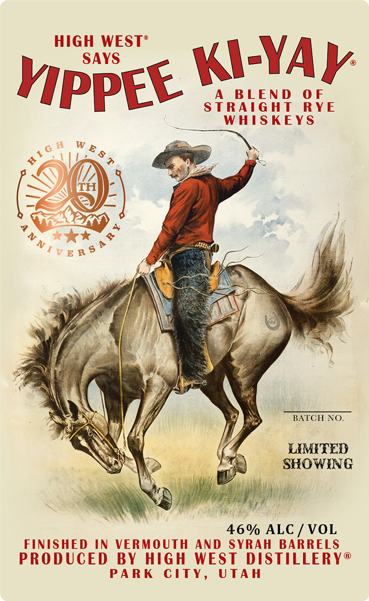
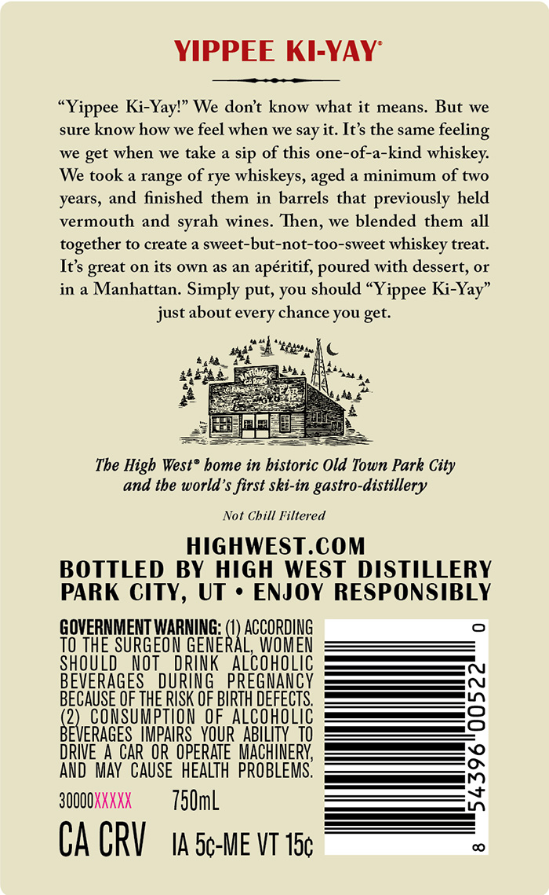

# TTB COLA Label Images - TTBID 26211001000794

**Brand Name:** HIGH WEST

**Fanciful Name:** YIPPEE KI-YAY

**Issue Date:** 08/06/2026

**Origin Code:** 45

**Product Class/Type:** 122

**Source:** [TTB Public COLA Registry](https://ttbonline.gov/colasonline/viewColaDetails.do?action=publicFormDisplay&ttbid=26211001000794)

## Label Images

### Label 1

### Label 2

## Extracted Label Text

*Text extracted via OCR - may contain errors*

**Detected Proof:** 92

### Label 1

hppet Way

BATCH NO.

LAMITED
SHOWING

46% ALC / VOL
FINISHED IN VERMOUTH AND SYRAH BARRELS
PRODUCED BY HIGH WEST DISTILLERY®
PARK CITY, UTAH

### Label 2

YIPPEE KI-YAY
Ki-Yayl" We dont know what it
means.
But
we
sure know how we feel when we say it: It s the same
we
get when we take a sip of this one-of-a-kind whiskey:
We took a range of rye whiskeys,
a minimum of two
years, and finished them in barrels that previously held
vermouth and
wines. Then, we blended them all
together to create a sweet-but-not-too-sweet whiskey treat
It's great on its own
a5 an
aperitif; poured with dessert,
or
in a Manhattan.
Simply put, you should "Yippee Ki-Yay"
just about
chance you get:
"402
The Higb West" bome in bistoric Old Town Park City
and the world'$ first ski-in gastro-distillery
Not Chill Filtered
HIGHWEST.COM
BOTTLED BY HIGH WEST DISTILLERY
PARK CITY, UT ' ENJOY RESPONSIBLY
GOVERNMENT WARNING:
ACCORDING
To THE SURGEOM GENERAL,WOMEN
SHOULD
NOT
DRINK
ALCOHOLIC
BEVERAGES
DURING
PREGNAnCY
BECAUSE QF THE RISK OF BIRTH DEFECTS
3
COnSUMPTION
OFALCOHOLIC
BeveRqhesu
IMPAIRS_YOURABILITY_TQ
DRIVE 4 CAR OR  OPERATE  MACHINERY;
AND   MA  CAUSE   HEALTH  PROBLEMS.
;
3OOOOKXKXX
750mL
Ca CRV
IA 5c-ME VT 15c
"Yippee
feeling
aged
syrah
every
