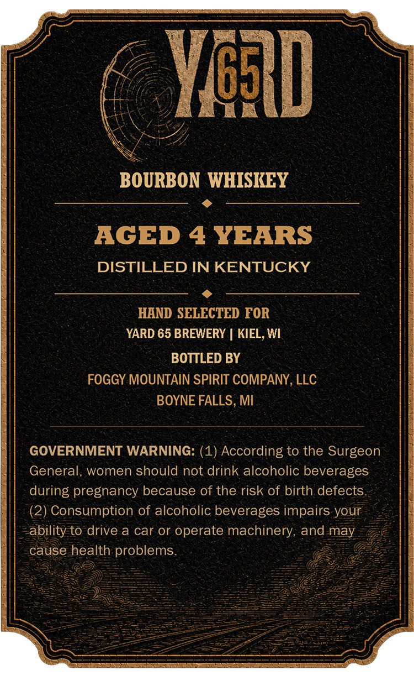
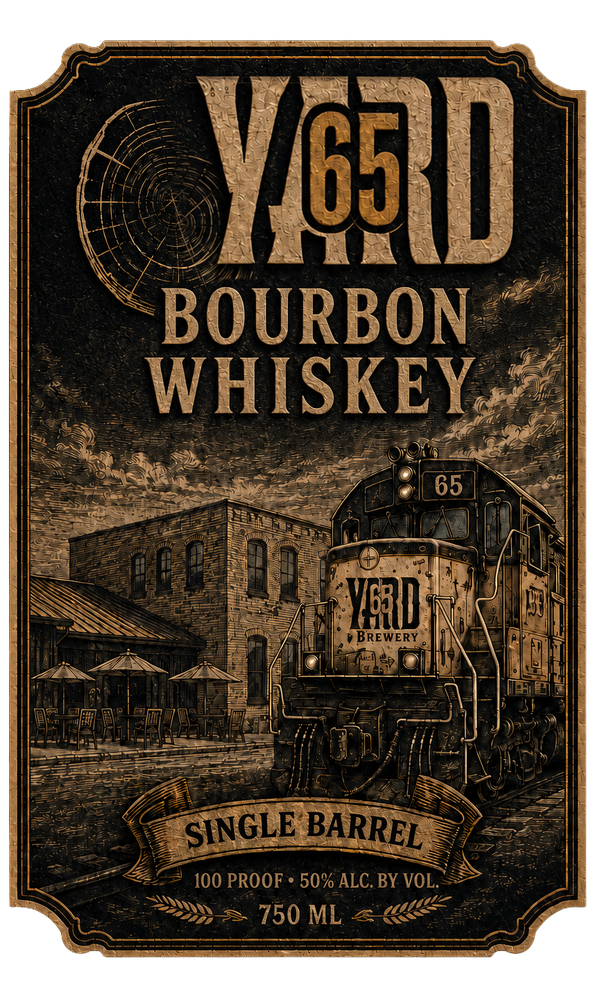

# TTB COLA Label Images - TTBID 26212001000034

**Brand Name:** YARD 65

**Issue Date:** 08/06/2026

**Origin Code:** 06

**Product Class/Type:** 141

**Source:** [TTB Public COLA Registry](https://ttbonline.gov/colasonline/viewColaDetails.do?action=publicFormDisplay&ttbid=26212001000034)

## Label Images

### Back Label

### Front Label

## Extracted Label Text

*Text extracted via OCR - may contain errors*

*1 image(s) excluded: text did not meet readability threshold*

**Detected Age:** 4 Years

### Back Label

YgAD
BOURBON WHISIEY
AGED 4 YEARS
DISTILLED IN KENTUCKY
HAND SELECTED FOR
YARD 65 BREWERY
KIEL, WI
BOTTLED BY
FOGGY MOUNTAIN SPIRIT COMPANY, LLC
BOYNE FALLS, MI
GOVERNMENT WARNING: (1) According to the Surgeon
General, women should not drink alcoholic beverages
during pregnancy because of the risk of birth defects
(2) Consumption of alcoholic beverages impairs your
ability to drive a car or operate machinery; and may
cause health problems
