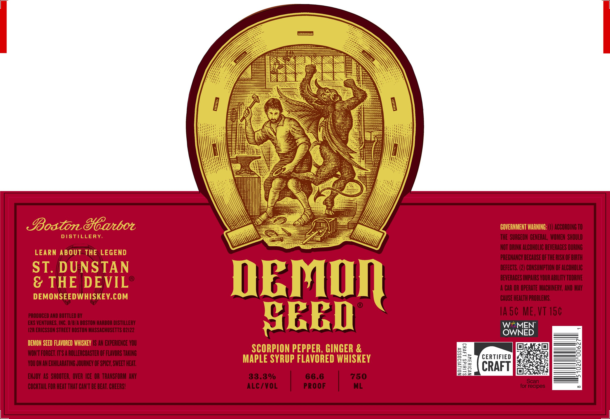
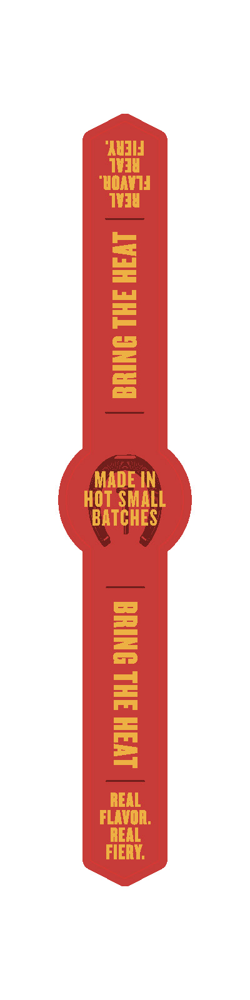

# TTB COLA Label Images - TTBID 26212001000078

**Brand Name:** DEMON SEED

**Issue Date:** 08/17/2026

**Origin Code:** 26

**Product Class/Type:** 149

**Source:** [TTB Public COLA Registry](https://ttbonline.gov/colasonline/viewColaDetails.do?action=publicFormDisplay&ttbid=26212001000078)

## Label Images

### Front Label

### Label 2

## Extracted Label Text

*Text extracted via OCR - may contain errors*

**Detected Proof:** 66.6

### Front Label

JBostondcaboz
COVERNMENT WARNING;
ACOORDINC T0
DiSTLLERY
THE SURHEOM BENERAL, WOMEN  Should
NOT DRINK ALCOHOLIC BEVERAHES DURING
LEARN About THE LEGEND
PREGMANCY BECAUSE OF THE RISKOF BHRIH
ST. DUNSTAN
DEFECTS; (2) CONSUMPTLOM OF ALCoholC
8 THE DEVIL
DEMD
BEVERACES MPARS VOURABILTY TODRIE
CAR OR OPERATE MACHINERY; AND MAY
DEMONSEEDWHISKEV.cOM
OAUSE HEALTHPROBLEMS;
PrODUCED AND BOjTLed BY
GEED
IA 50 ME,VT 150
EKS VENTURES; INC; @/BFA BOSTON HARBOR DISTILLERY
W
MEN"
zr ERICSSON STREET boston MASSACHUSETTSS 02022
OWNED
DEMON SEED FLAVORED WHISKEY |S AM EXPERIENOE Vou
MONT FORGET; USA ROLLERCOASTER OF FLAORS TAKING
SCORPION PEPPER, GINGER &
5
YOU ON AN EXHILARATING JOURNEY OF SPICY, SWEET HEAT,
MAPLE SYRUP FLAVORED WHISKEY
m
CERTIFIED
CRAFT
Q
ENJOY AS  SHOOTER;  OVER ICE   OR  TRANSFORM ANY
33.3%
66.6
750
Scan
COCKTAIL FOR HERT THAT CANFT BE BEAT; CHEERSL
ALC/VOL
PROOF
ML
for recipes

### Label 2

BRING THE HEAT

MADEIN
HOT SMALL

BATCHES

BS
=
=
i]
|
2S
Loa |
=
Pra
es
=J
REAL
FLAVOR.
REAL
FIERY.
