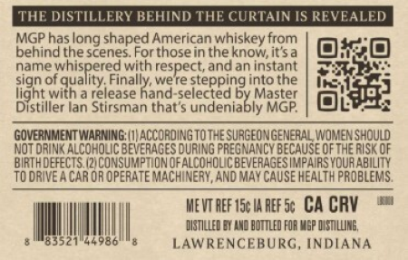
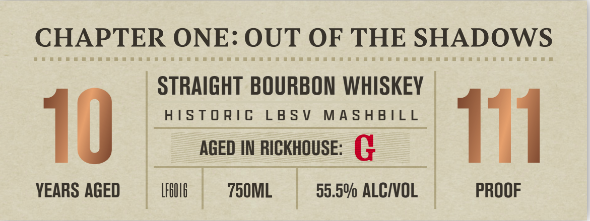
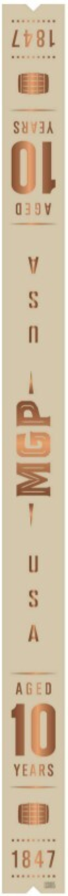
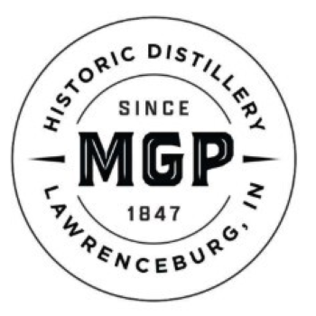

# TTB COLA Label Images - TTBID 26212001000372

**Brand Name:** CHAPTER ONE: OUT OF THE SHADOWS

**Issue Date:** 09/03/2026

**Origin Code:** 44

**Product Class/Type:** 101

**Source:** [TTB Public COLA Registry](https://ttbonline.gov/colasonline/viewColaDetails.do?action=publicFormDisplay&ttbid=26212001000372)

## Label Images

### Back Label

### Label 1

### Label 3

### Label 4

## Extracted Label Text

*Text extracted via OCR - may contain errors*

*1 image(s) excluded: text did not meet readability threshold*

**Detected Proof:** 111

### Back Label

THE DISTILLERY BEHIND THE CURTAIN IS REVEALED
MGP has
shaped American whiskey from
behind the scenes. Forthosein the knowitsa
name
with
aninstant
sign
E
ednaith reepesteppdhgmnotane
light
release hand-selected
eleddeaisbly
Master
Distiller Ian Stirsman that
MGP
GOVERNMENT WARNING  LIACC ORdInG T othe SuRGEONGENERAL lomEN Should
Not @RIN < ALCoHOLICBEVERAGES CURING PREGNANCYBECAUSE OFTHE RISK OF
BIRTH DEFECTS (21ConSuMpTION OFALCOHOVCBEVERAGES IMPAIRS YouR ABILITY
TO DRIVEACAR OR OPERATEMACHINERY, AND MAY CAUSE HeALTh pRdblemS.
MeWT REF I5c Ia REF 5c CA CRV
DISTILLED Eu ND BOutled FOR VEP [ SOLLINE;
LAWRENCERURG
INDIANA
long
and
14986'

### Label 1

CHAPTER ONE: OUT OF THE SHADOWS
STRAIGHT BOURBON WHISKEY
HISTORIC LBSV MASHBILL
AGED IN RICKHOUSE: (
VEARS AGED [flit 750ML_ = 55.5% ALCIVOL PROOF

### Label 3

seer enna

Lvs

——

SUvdA

Ol

O3gv

AGED

1)

YEARS

ie
