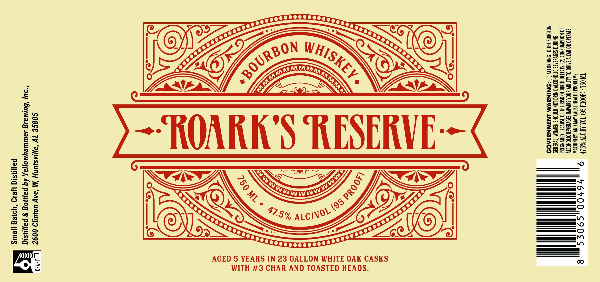

# TTB COLA Label Images - TTBID 26212001000450

**Brand Name:** YELLOWHAMMER BREWING, INC.

**Fanciful Name:** ROARK'S RESERVE

**Issue Date:** 09/09/2026

**Origin Code:** 10

**Product Class/Type:** 101

**Source:** [TTB Public COLA Registry](https://ttbonline.gov/colasonline/viewColaDetails.do?action=publicFormDisplay&ttbid=26212001000450)

## Label Images

### Label 1

## Extracted Label Text

*Text extracted via OCR - may contain errors*

**Detected Age:** 5 Years

### Label 1

Small Batch, Craft Distilled

Distilled & Bottled by Yellowhammer Brewing, Inc.,
2600 Clinton Ave, W, Huntsville, AL 35805

CRAFT 1

AGED 5 YEARS IN 23 GALLON WHITE OAK CASKS
WITH #3 CHAR AND TOASTED HEADS.

TO DRIVE A CAR OR OPERATE

‘AUSE

GOVERNMENT WARNING: (1) ACCORDING 10 THE SURGEON

GENERAL, WOMEN SHOULD NOT
