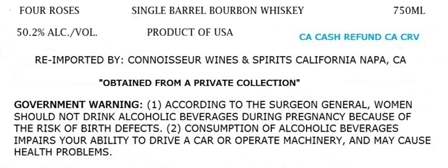
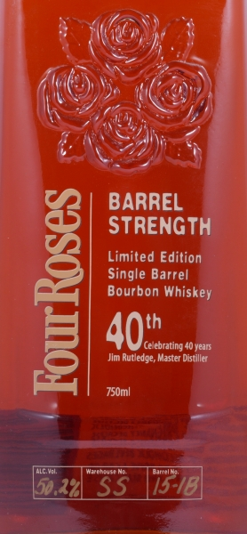

# TTB COLA Label Images - TTBID 26212001000486

**Brand Name:** FOUR ROSES

**Fanciful Name:** 40TH ANNIVERSARY

**Issue Date:** 08/07/2026

**Origin Code:** 00

**Product Class/Type:** 141

**Source:** [TTB Public COLA Registry](https://ttbonline.gov/colasonline/viewColaDetails.do?action=publicFormDisplay&ttbid=26212001000486)

## Label Images

### Label 1

### Label 2

## Extracted Label Text

*Text extracted via OCR - may contain errors*

**Detected Proof:** 100.4

### Label 1

FOUR ROSES
SINGLE BARREL BOURBON WHISKEY
750ML
50.2% ALC /VOL
PRODUCT OF USA
CA CASH REFUND CA CRV
RE-IMPORTED BY: CONNOISSEUR WINES & SPIRITS CALIFORNIA NAPA, CA
"OBTAINED FROM A PRIVATE COLLECTION"
GOVERNMENT WARNING: (1) ACCORDING TO THE SURGEON GENERAL, WOMEN
SHOULD NOT DRINK ALCOHOLIC BEVERAGES DURING PREGNANCY BECAUSE OF
THE RISK OF BIRTH DEFECTS. (2) CONSUMPTION OF ALCOHOLIC BEVERAGES
IMPAIRS YOUR ABILITY TO DRIVE A CAR OR OPERATE MACHINERY, AND MAY CAUSE
HEALTH PROBLEMS

### Label 2

BARREL
STRENGTH
Limited Edition
Single Barrel
Bourbon Whiskey

GO ane

Jim Rutledge, Master Distr

750m!
