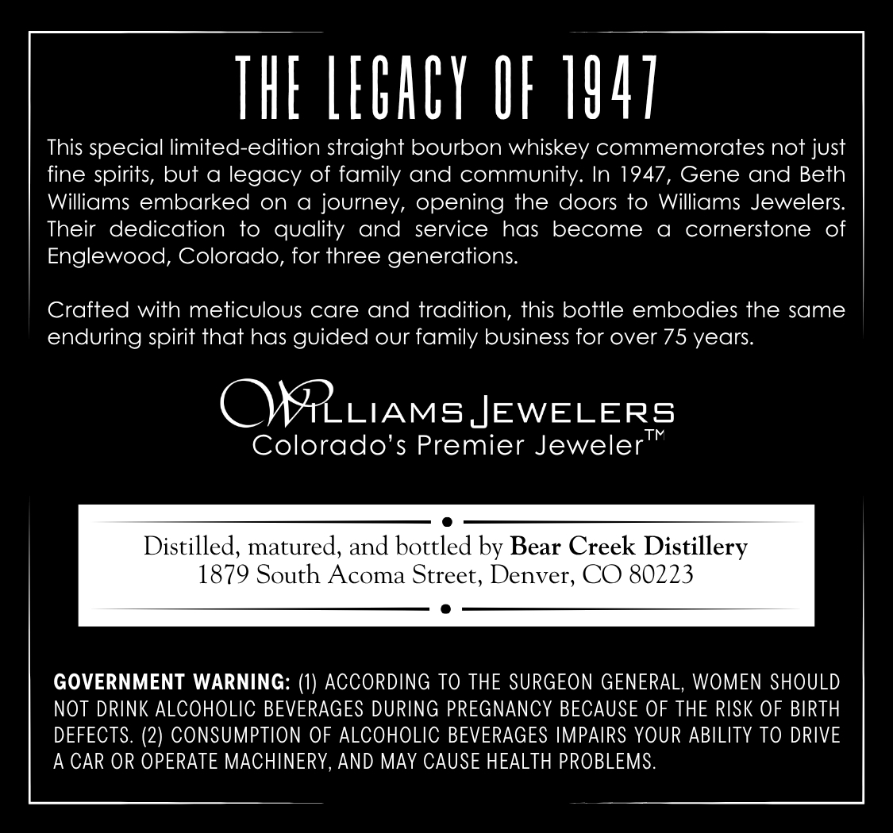
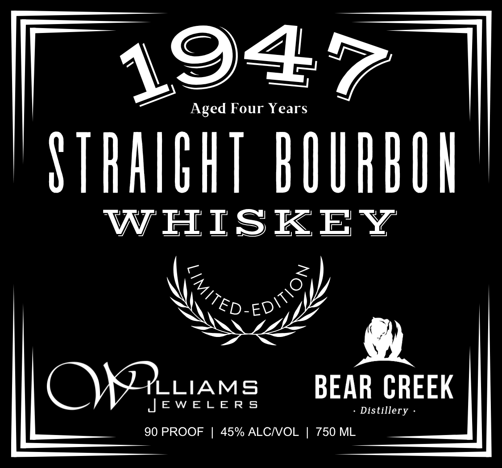

# TTB COLA Label Images - TTBID 26212001000487

**Brand Name:** BEAR CREEK DISTILLERY

**Issue Date:** 08/06/2026

**Origin Code:** 13

**Product Class/Type:** 101

**Source:** [TTB Public COLA Registry](https://ttbonline.gov/colasonline/viewColaDetails.do?action=publicFormDisplay&ttbid=26212001000487)

## Label Images

### Back Label

### Front Label

## Extracted Label Text

*Text extracted via OCR - may contain errors*

**Detected Proof:** 90

### Back Label

THE LEGACY IF 1447
This special limited-edition straight bourbon whiskey commemorates not just
spirits, but a legacy of family and community: In 1947, Gene and Beth
Williams embarked
on
a
journey, opening the doors to Williams Jewelers:
Their   dedication
to
quality
and service
has become
a
cornerstone
of
Englewood; Colorado, for three generations:
Crafted with meticulous care and tradition, this bottle embodies the same
enduring spirit that has guided our family bUsiness for over 75 years
OMRLIAMSJEWELERS
TM
Colorado's Premier Jeweler
Distilled, matured, and bottled by Bear Creek Distillery
1879 South Acoma Street; Denver, CO 80223
GOVERNMENT WARNING:
ACCORDING TO THE SURGEON GENERAL, WOMEN SHOULD
NOT DRINK ALCOHOLIC BEVERAGES DURING PREGNANCY BECAUSE OF THE RISK OF BIRTH
DEFECTS: (2) CONSUMPTION OF ALCOHOLIC BEVERAGES IMPAIRS YOUR ABILITY TO DRIVE
A CAR OR OPERATE MACHINERY, AND MAY CAUSE HEALTH PROBLEMS.
fine

### Front Label

1947
Aged Four Years
SThaIghT bOUhbUU
WHISKEY
Kted-ED  9
OKXYIAM:
BEAR CREEK
JEW EL E R 5
Distillery
90 PROOF
45% ALCNOL
750 ML
