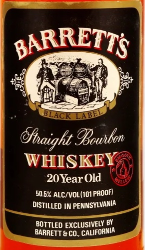

# TTB COLA Label Images - TTBID 26212001000500

**Brand Name:** BARRETT'S

**Fanciful Name:** 20 YEAR OLD

**Issue Date:** 08/06/2026

**Origin Code:** 00

**Product Class/Type:** 101

**Source:** [TTB Public COLA Registry](https://ttbonline.gov/colasonline/viewColaDetails.do?action=publicFormDisplay&ttbid=26212001000500)

## Label Images

### Back Label

### Label 2

## Extracted Label Text

*Text extracted via OCR - may contain errors*

**Detected Proof:** 101
**Detected Age:** 20 Years

### Back Label

BARRETTS
Gp
ACK
IBouhbon
WHISKEY
20 Year
~50.5% ALC/VOL(101 PROOF)
DISTILLED IN PENNSYLVANIA
BOTTLED EXCLUSIVELY BY
BARRETT & CO, CALIFORNIA
0
Ofhaight
Old

### Label 2

RE-IMPORTED BY: CONNOISSEUR WINES & SPIRITS CALIFORNIA NAPA,CA

"OBTAINED FROM A PRIVATE COLLECTION"

CACASHED REFUND CACRV

GOVERNMENT WARNING: (1) ACCORDING TO THE SURGEON GENERAL, WOMEN

SHOULD NOT DRINK ALCOHOLIC BEVERAGES DURING PREGNANCY BECAUSE OF THE

RISK OF BIRTH DEFECTS. (2) CONSUMPTION OF ALCOHOLIC BEVERAGES IMPAIRS YOUR

ABILITY TO DRIVE A CAR OR OPERATE MACHINERY, AND MAY CAUSE HEALTH PROBLEMS.
