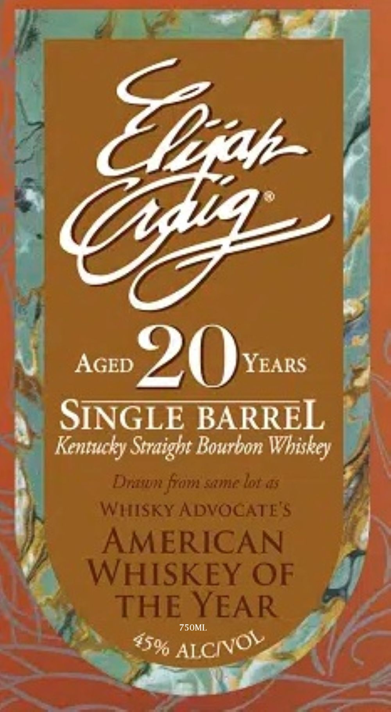

# TTB COLA Label Images - TTBID 26212001000513

**Brand Name:** ELIJAG CRAIG

**Fanciful Name:** AGED 20 YEARS

**Issue Date:** 08/07/2026

**Origin Code:** 00

**Product Class/Type:** 101

**Source:** [TTB Public COLA Registry](https://ttbonline.gov/colasonline/viewColaDetails.do?action=publicFormDisplay&ttbid=26212001000513)

## Label Images

### Label 1

### Label 2

## Extracted Label Text

*Text extracted via OCR - may contain errors*

**Detected Proof:** 90
**Detected Age:** 20 Years

### Label 1

Ezah
Tsg
AGED
20
YEARS
SINGLE BARREL
Kentucky Srraight Bourbon
Dutibn fom same lot $
WIsKy ADVOCATE'$
AMERICAN
WHISKEY OF
THE YEAR
750ML
Whiskey
AICIvOL
45%

### Label 2

RE-IMPORTED BY: CONNOISSEUR WINES & SPIRITS CALIFORNIA NAPA,CA

"OBTAINED FROM A PRIVATE COLLECTION"

CACASHED REFUND CACRV

GOVERNMENT WARNING: (1) ACCORDING TO THE SURGEON GENERAL, WOMEN

SHOULD NOT DRINK ALCOHOLIC BEVERAGES DURING PREGNANCY BECAUSE OF THE

RISK OF BIRTH DEFECTS. (2) CONSUMPTION OF ALCOHOLIC BEVERAGES IMPAIRS YOUR

ABILITY TO DRIVE A CAR OR OPERATE MACHINERY, AND MAY CAUSE HEALTH PROBLEMS.
