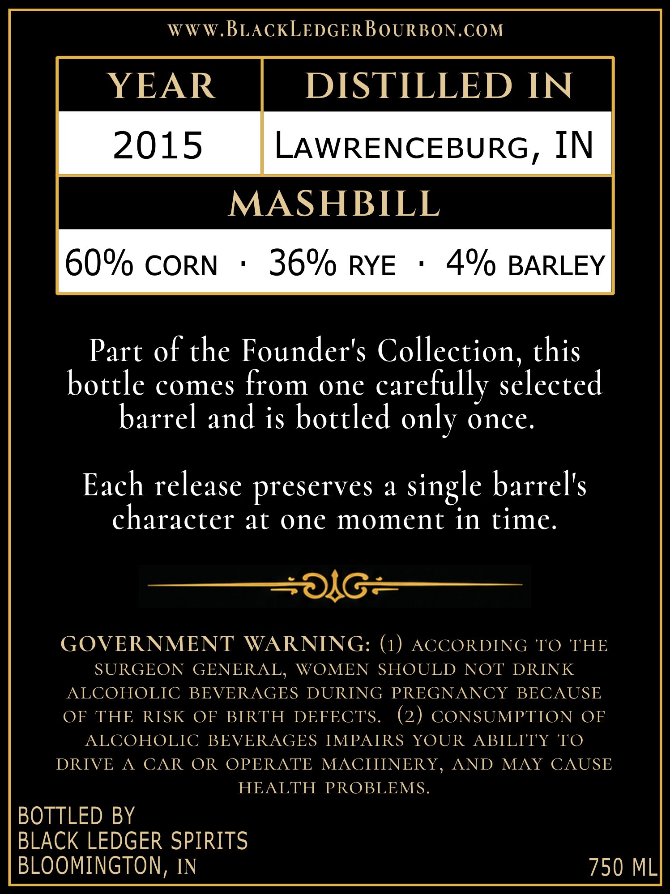
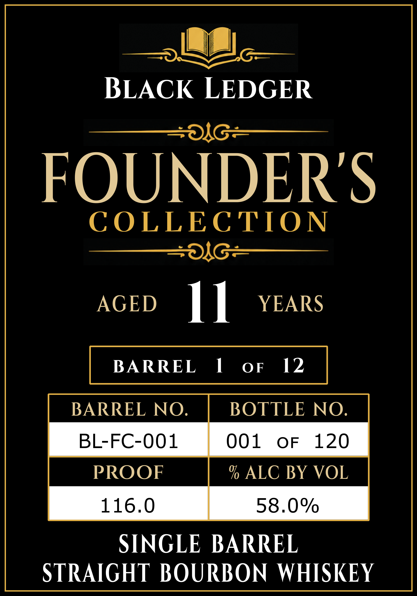

# TTB COLA Label Images - TTBID 26212001000553

**Brand Name:** BLACK LEDGER FOUNDERS COLLECTION

**Issue Date:** 08/07/2026

**Origin Code:** 19

**Product Class/Type:** 101

**Source:** [TTB Public COLA Registry](https://ttbonline.gov/colasonline/viewColaDetails.do?action=publicFormDisplay&ttbid=26212001000553)

## Label Images

### Back Label

### Front Label

## Extracted Label Text

*Text extracted via OCR - may contain errors*

**Detected Proof:** 120

### Back Label

WWW.BLACKLEDGERBoURBON.COM
YEAR
DISTILLED IN
2015
LAWRENCEBURG, IN
MASHBILL
60% CORN
36% RYE
4%
BARLEY
Part of the Founder's Collection, this
bottle comes from one
carefully selected
barrel and is bottled only once:
Each release preserves
a
single barrel's
character at one moment in time.
#OL6"
GOVERNMENT
WARNING: (1) ACCORDING TO THE
SURGEON GENERAL,
WOMEN SHOULD NOT DRINK
ALCOHOLIC BEVERAGES DURING PREGNANCY BECAUSE
OF THE RISK
OF BIRTH
DEFECTS.
(2
CONSUMPTION
OF
ALCOHOLIC BEVERAGES IMPAIRS YOUR
ABILITY TO
DRIVE
A
CAR
OR OPERATE MACHINERY
AND
MAY CAUSE
HEALTH
PROBLEMS.
BOTTLED BY
BLACK LEDGER SPIRITS
BLOOMINGTON; IN
750 ML

### Front Label

|_|
BLACK LEDGER
Salo =—_|_*§_

FOUNDERS

COLLECTION
=| o-—————_

AGED 1] YEARS

BARREL NO. BOTTLE NO.

BL-FC-001 O01 oF 120

PROOF % ALC BY VOL

116.0 58.0%

SINGLE BARREL
STRAIGHT BOURBON WHISKEY
