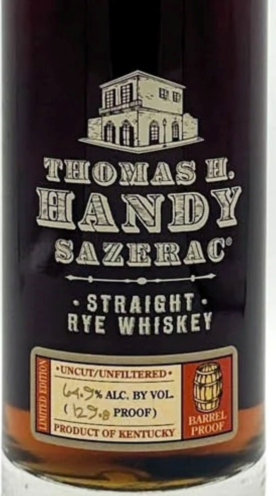

# TTB COLA Label Images - TTBID 26212001000589

**Brand Name:** THOMAS H. HANDY

**Fanciful Name:** BARREL PROOF

**Issue Date:** 08/06/2026

**Origin Code:** 00

**Product Class/Type:** 102

**Source:** [TTB Public COLA Registry](https://ttbonline.gov/colasonline/viewColaDetails.do?action=publicFormDisplay&ttbid=26212001000589)

## Label Images

### Label 1

### Label 2

## Extracted Label Text

*Text extracted via OCR - may contain errors*

**Detected Proof:** 129.8

### Label 1

TEOMAS H
HANDY
SAZERAC
S
STRAIGHI.
RYE WHISKEY
"UNCUTIUNELTERED_
[
ALC . BY VOL
(129.8 PROOF)
OF KENTUCKY
45*
KARREL
TROOF
FRODUCT

### Label 2

RE-IMPORTED BY: CONNOISSEUR WINES & SPIRITS CALIFORNIA NAPA,CA

"OBTAINED FROM A PRIVATE COLLECTION"

CACASHED REFUND CACRV

GOVERNMENT WARNING: (1) ACCORDING TO THE SURGEON GENERAL, WOMEN

SHOULD NOT DRINK ALCOHOLIC BEVERAGES DURING PREGNANCY BECAUSE OF THE

RISK OF BIRTH DEFECTS. (2) CONSUMPTION OF ALCOHOLIC BEVERAGES IMPAIRS YOUR

ABILITY TO DRIVE A CAR OR OPERATE MACHINERY, AND MAY CAUSE HEALTH PROBLEMS.
