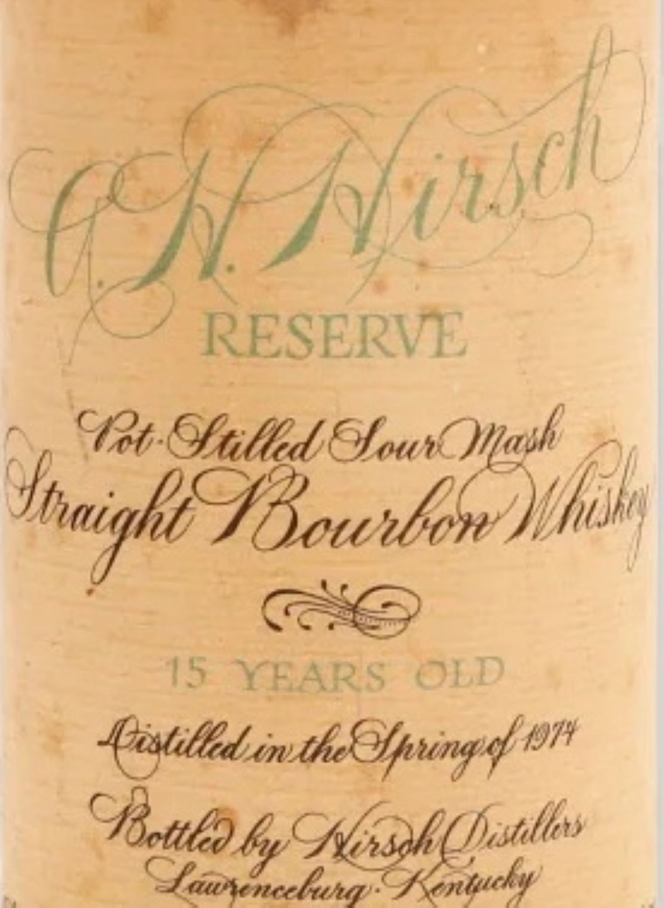
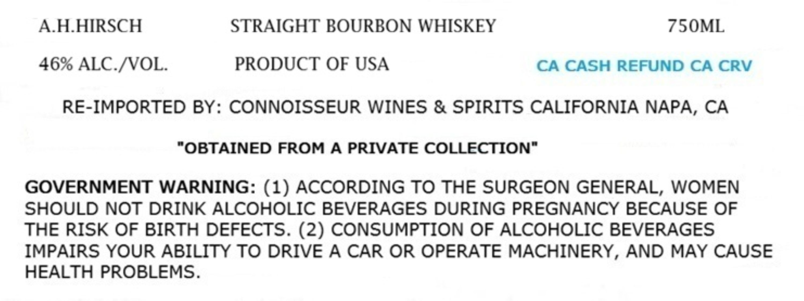

# TTB COLA Label Images - TTBID 26212001000594

**Brand Name:** A.H.HIRSCH

**Fanciful Name:** 15 YEAR OLD RESERVE

**Issue Date:** 08/06/2026

**Origin Code:** 00

**Product Class/Type:** 101

**Source:** [TTB Public COLA Registry](https://ttbonline.gov/colasonline/viewColaDetails.do?action=publicFormDisplay&ttbid=26212001000594)

## Label Images

### Back Label

### Label 1

## Extracted Label Text

*Text extracted via OCR - may contain errors*

**Detected Proof:** 92

### Back Label

RESERVE
Gillhd SfoutOYask
IhaigkiFBounbere )thk
45
YBARS
OLD
{istiledyitheefpung d 1974
 6y9 Nrsh (nllos
Sfaunencelunas
Kntacky}
dusck
cd? t
cpattlo

### Label 1

AHHIRSCH
STRAIGHT BOURBON WHISKEY
750ML
46% ALC /VOL
PRODUCT OF USA
CA CASH REFUND CA CRV
RE-IMPORTED BY: CONNOISSEUR WINES & SPIRITS CALIFORNIA NAPA, CA
"OBTAINED FROM A PRIVATE COLLECTION"
GOVERNMENT WARNING: (1) ACCORDING TO THE SURGEON GENERAL, WOMEN
SHOULD NOT DRINK ALCOHOLIC BEVERAGES DURING PREGNANCY BECAUSE OF
THE RISK OF BIRTH DEFECTS. (2) CONSUMPTION OF ALCOHOLIC BEVERAGES
IMPAIRS YOUR ABILITY TO DRIVE A CAR OR OPERATE MACHINERY, AND MAY CAUSE
HEALTH PROBLEMS.
