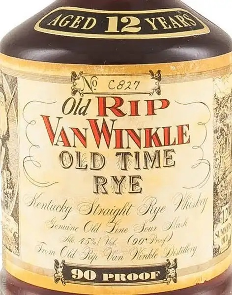
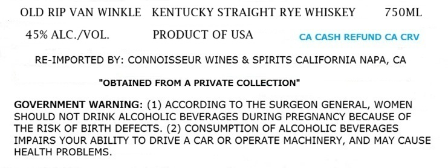

# TTB COLA Label Images - TTBID 26212001000613

**Brand Name:** OLD RIP VAN WINKLE

**Fanciful Name:** OLD TYME RYE

**Issue Date:** 08/06/2026

**Origin Code:** 00

**Product Class/Type:** 102

**Source:** [TTB Public COLA Registry](https://ttbonline.gov/colasonline/viewColaDetails.do?action=publicFormDisplay&ttbid=26212001000613)

## Label Images

### Back Label

### Label 1

## Extracted Label Text

*Text extracted via OCR - may contain errors*

**Detected Proof:** 90

### Back Label

AGED {ZH

© Van WINKLE):
L OLD TIME 2;
RNE y
Sy “lucky Wraigll Aye Tht

mine Ot Fine Sour I.
Me 25% ie Cog Fog? Pal
Cid Typ Vin File LEO

y)

ets

* Mex PROOF * m

### Label 1

OLD RIP VAN WINKLE
KENTUCKY STRAIGHT RYE WHISKEY
75OML
45% ALC /VOL
PRODUCT OF USA
CA CASH REFUND CA CRV
RE-IMPORTED BY: CONNOISSEUR WINES & SPIRITS CALIFORNIA NAPA, CA
"OBTAINED FROM A PRIVATE COLLECTION"
GOVERNMENT WARNING: (1) ACCORDING TO THE SURGEON GENERAL, WOMEN
SHOULD NOT DRINK ALCOHOLIC BEVERAGES DURING PREGNANCY BECAUSE OF
THE RISK OF BIRTH DEFECTS. (2) CONSUMPTION OF ALCOHOLIC BEVERAGES
IMPAIRS YOUR ABILITY TO DRIVE A CAR OR OPERATE MACHINERY, AND MAY CAUSE
HEALTH PROBLEMS
