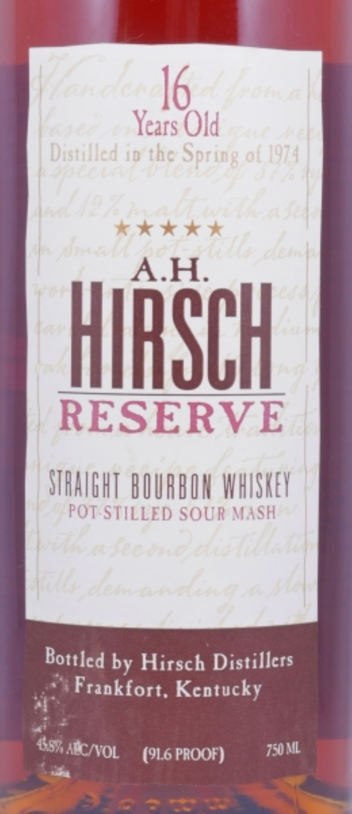

# TTB COLA Label Images - TTBID 26213001000014

**Brand Name:** A.H. HIRSCH

**Fanciful Name:** 16 YEARS OLD RESERVE

**Issue Date:** 08/11/2026

**Origin Code:** 22

**Product Class/Type:** 101

**Source:** [TTB Public COLA Registry](https://ttbonline.gov/colasonline/viewColaDetails.do?action=publicFormDisplay&ttbid=26213001000014)

## Label Images

### Label 1

### Label 2

## Extracted Label Text

*Text extracted via OCR - may contain errors*

**Detected Proof:** 91.6

### Label 1

1   16 |
1
Years Old
|
Dastilled 4D tbe
01 /974
sngiiu iiC `

 |

I ^ |
AH
HIRSCH
RESERVE
STHAVGHT BUURBOH WHUSHEY
POT STILLED SOUR MASH
|
1 |
by Hirsch Distillers
Frankfort, Kcntucky
4531
(91.6 PROOF)
ML
Sprio8

Bottled
AECNVOL
750[

### Label 2

RE-IMPORTED BY: CONNOISSEUR WINES & SPIRITS CALIFORNIA NAPA,CA

"OBTAINED FROM A PRIVATE COLLECTION"

CACASHED REFUND CACRV

GOVERNMENT WARNING: (1) ACCORDING TO THE SURGEON GENERAL, WOMEN

SHOULD NOT DRINK ALCOHOLIC BEVERAGES DURING PREGNANCY BECAUSE OF THE

RISK OF BIRTH DEFECTS. (2) CONSUMPTION OF ALCOHOLIC BEVERAGES IMPAIRS YOUR

ABILITY TO DRIVE A CAR OR OPERATE MACHINERY, AND MAY CAUSE HEALTH PROBLEMS.
