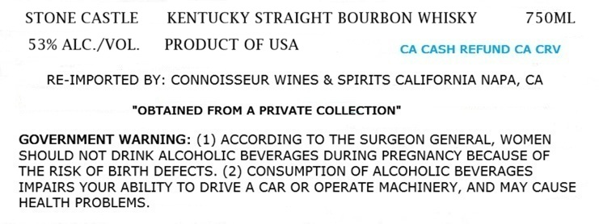
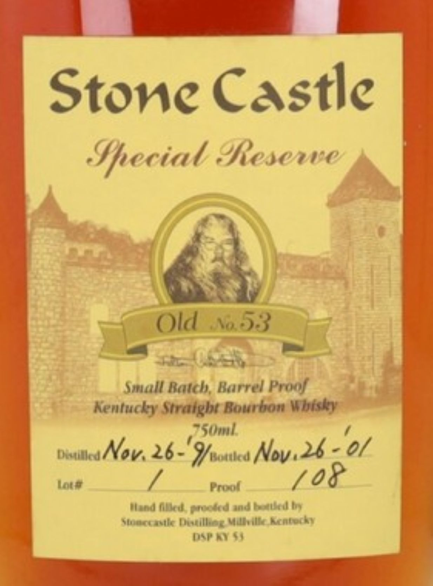

# TTB COLA Label Images - TTBID 26213001000017

**Brand Name:** STONE CASTLE

**Fanciful Name:** SPECIAL RESERVE

**Issue Date:** 08/11/2026

**Origin Code:** 22

**Product Class/Type:** 101

**Source:** [TTB Public COLA Registry](https://ttbonline.gov/colasonline/viewColaDetails.do?action=publicFormDisplay&ttbid=26213001000017)

## Label Images

### Label 1

### Label 2

## Extracted Label Text

*Text extracted via OCR - may contain errors*

**Detected Proof:** 106

### Label 1

STONE CASTLE
KENTUCKY STRAIGHT BOURBON WHISKY
75OML
53% ALC /VOL
PRODUCT OF USA
CA CASH REFUND CA CRV
RE-IMPORTED BY: CONNOISSEUR WINES & SPIRITS CALIFORNIA NAPA, CA
"OBTAINED FROM A PRIVATE COLLECTION"
GOVERNMENT WARNING: (1) ACCORDING TO THE SURGEON GENERAL, WOMEN
SHOULD NOT DRINK ALCOHOLIC BEVERAGES DURING PREGNANCY BECAUSE OF
THE RISK OF BIRTH DEFECTS. (2) CONSUMPTION OF ALCOHOLIC BEVERAGES
IMPAIRS YOUR ABILITY TO DRIVE A CAR OR OPERATE MACHINERY, AND MAY CAUSE
HEALTH PROBLEMS

### Label 2

Stone Castle
Special eResenre
Old,153
Small Batch; Barrel Prof
Kenfucky Stratght Bourbon Wbtsky
S0ml
Duuilledt
Nov; 26-' 9ftked Nov.26 - 0/
Inta
Fruol
7o8
Mend (kden-td mndturdh
slatniau asla [aatilheg Wuleilla Aentetah
epad$
