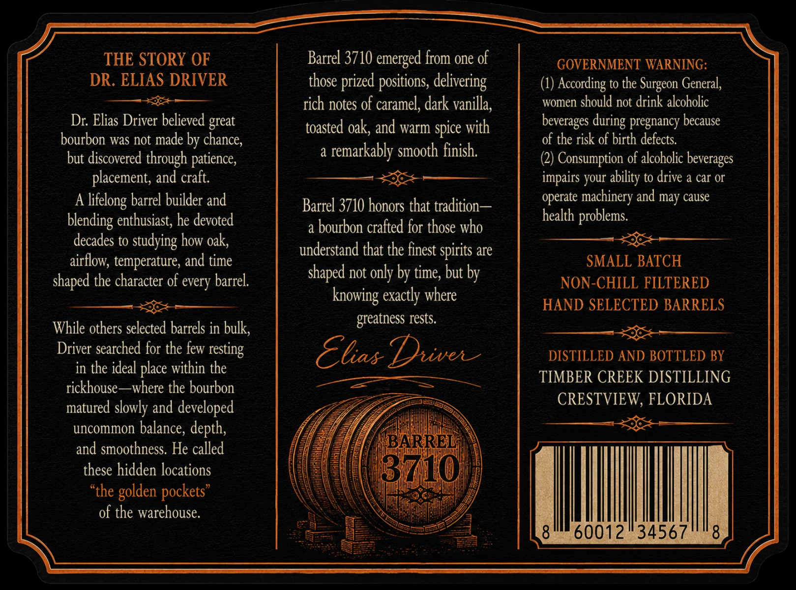
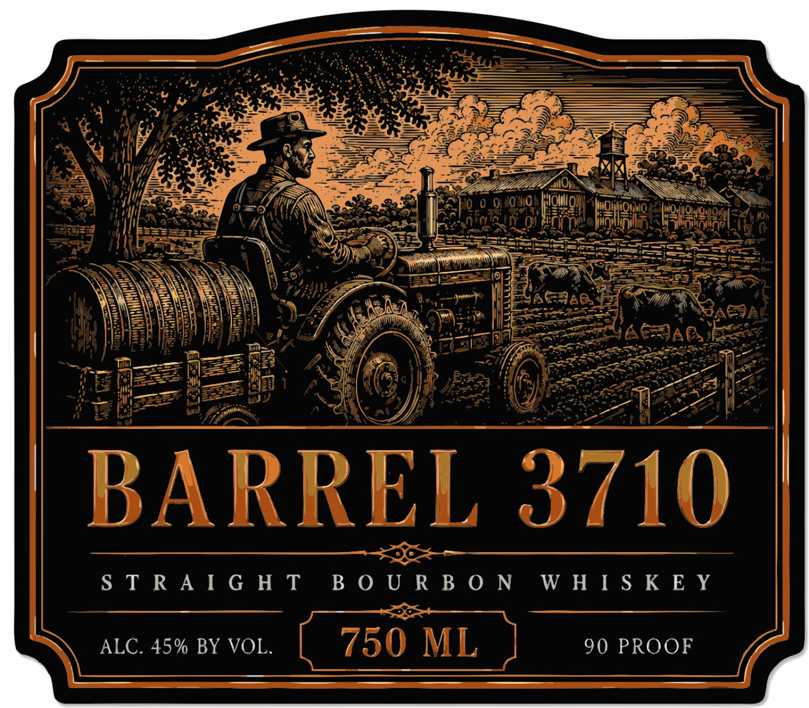

# TTB COLA Label Images - TTBID 26213001000022

**Brand Name:** BARREL 3710

**Issue Date:** 08/11/2026

**Origin Code:** 16

**Product Class/Type:** 101

**Source:** [TTB Public COLA Registry](https://ttbonline.gov/colasonline/viewColaDetails.do?action=publicFormDisplay&ttbid=26213001000022)

## Label Images

### Back Label

### Front Label

## Extracted Label Text

*Text extracted via OCR - may contain errors*

*1 image(s) excluded: text did not meet readability threshold*

### Back Label

THE STORY OF
Barrel 3710 emerged from one of
GOVERNMENT WARNING:
DR ELIAS DRIVER
those
positions, delivering
(1) According to the
General,
rich notes of caramel; dark vanilla;
women should not drink alcoholic
Dr: Elias Driver believed great
toasted oak; and warm spice with
beverages
pregnancy because
bourbon was not made by chance;
of the risk of birth defects.
but discovered through patience,
a
remarkably smooth finish;
(2) Consumption of alcoholic beverages
placement, and craft
impairs your
to drive a car O
A
barrel builder and
Barrel 3710 honors that tradition
operate machinery and may cause
enthusiast; he devoted
health problems.
a
bourbon crafted for those who
decades to studying how oak;
understand that the finest spirits are
airflow; temperature, and time
SMALL BATCH
shaped the character of every barrel.
shaped not only by time; but by
NON-CHILL FILTERED
exactly where
HAND SELECTED BARRELS
greatness rests.
While others selected barrels in bulk;
Driver searched for the few
Ekas Duiven
DISTILLED AND BOTTLED BY
in the ideal place within the
TIMBER CREEK DISTILLING
rickhouse ~where the bourbon
matured slowly and developed
CRESTVIEW, FLORIDA
uncommon balance, depth,
and smoothness. He called
BARREL
these hidden locations
3710
"the
of the warehouse.
8
60012
34567
8
prized
Surgeon
during
ability
lifelong
blending
knowing
resting
golden
pockets"
