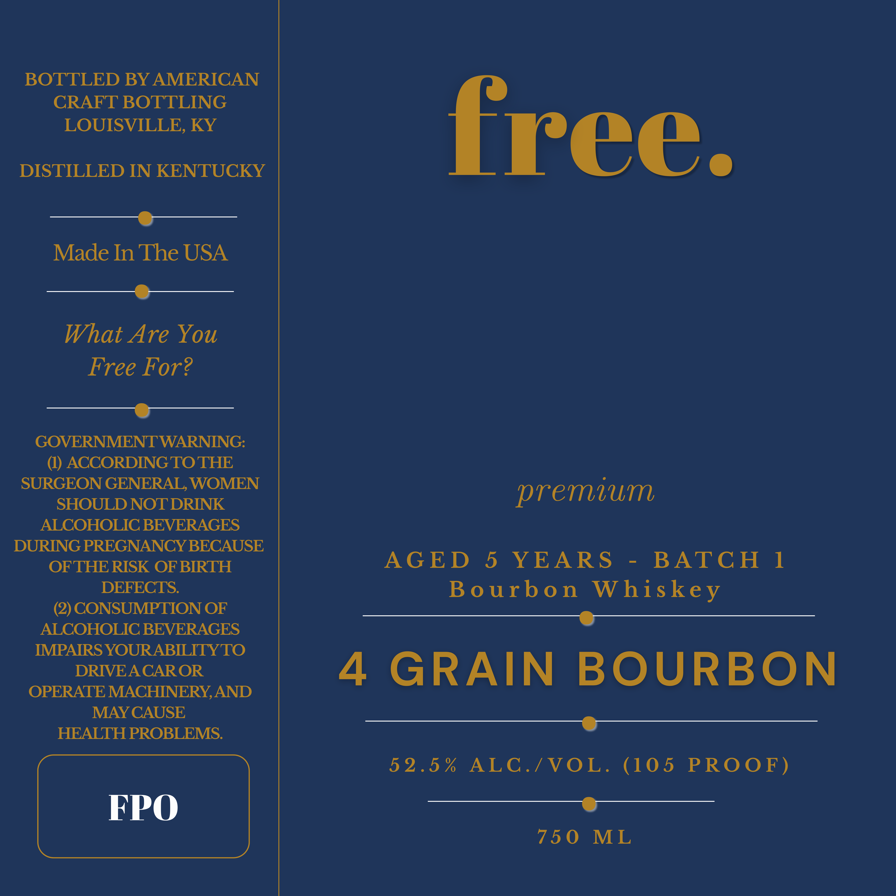

# TTB COLA Label Images - TTBID 26213001000046

**Brand Name:** FREE.

**Issue Date:** 08/17/2026

**Origin Code:** 22

**Product Class/Type:** 101

**Source:** [TTB Public COLA Registry](https://ttbonline.gov/colasonline/viewColaDetails.do?action=publicFormDisplay&ttbid=26213001000046)

## Label Images

### Label 1

## Extracted Label Text

*Text extracted via OCR - may contain errors*

**Detected Proof:** 105
**Detected Age:** 5 Years

### Label 1

BOTTLED BY AMERICAN
CRAFT BOTTLING
LOUISVILLE, KY

DISTILLED IN KENTUCKY

a
Made In The USA

a _ J

What Are You
Free For?

a

GOVERNMENT WARNING:
(1) ACCORDING TO THE
SURGEON GENERAL, WOMEN
SHOULD NOT DRINK
ALCOHOLIC BEVERAGES
DURING PREGNANCY BECAUSE
OF THE RISK OF BIRTH
DEFECTS.

(2) CONSUMPTION OF
ALCOHOLIC BEVERAGES
IMPAIRS YOURABILITY TO
DRIVE A CAR OR
OPERATE MACHINERY, AND
MAY CAUSE
HEALTH PROBLEMS.

FPO

free.

premium

AGED 5 YEARS - BATCH 1
Bourbon Whiskey

4 GRAIN BOURBON

52.5% ALC./VOL. (105 PROOF)

750 ML
