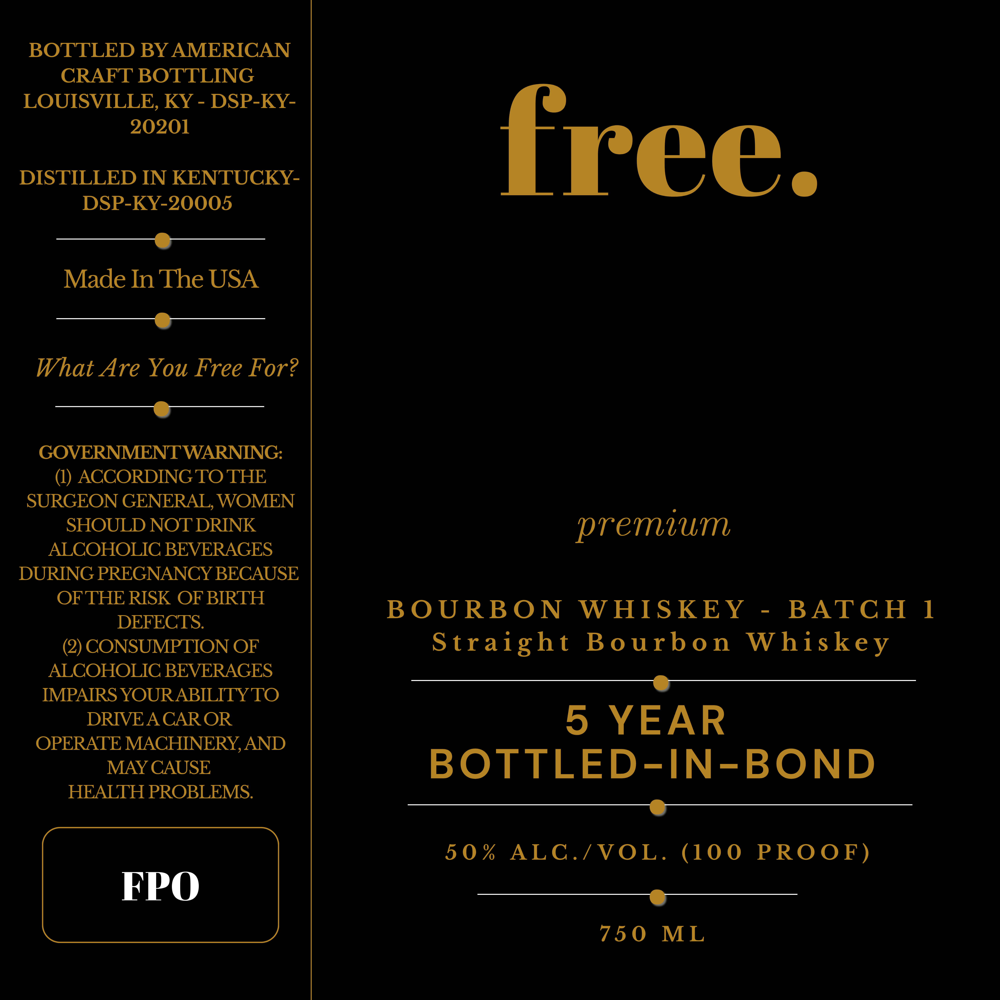

# TTB COLA Label Images - TTBID 26213001000048

**Brand Name:** FREE.

**Issue Date:** 08/20/2026

**Origin Code:** 22

**Product Class/Type:** 111

**Source:** [TTB Public COLA Registry](https://ttbonline.gov/colasonline/viewColaDetails.do?action=publicFormDisplay&ttbid=26213001000048)

## Label Images

### Label 1

## Extracted Label Text

*Text extracted via OCR - may contain errors*

**Detected Proof:** 100

### Label 1

BOTTLED BY AMERICAN
CRAFT BOTTLING
LOUISVILLE, KY - DSP-KY-
20201

DISTILLED IN KENTUCKY-
DSP-KY-20005

———_@@___——-
Made In The USA
a

What Are You Free For?
————.-—_———————_

GOVERNMENT WARNING:
(1) ACCORDING TO THE
SURGEON GENERAL, WOMEN
SHOULD NOT DRINK
ALCOHOLIC BEVERAGES
DURING PREGNANCY BECAUSE
OFTHE RISK OF BIRTH
DEFECTS.

(2) CONSUMPTION OF
ALCOHOLIC BEVERAGES
IMPAIRS YOUR ABILITY TO
DRIVE A CAROR
OPERATE MACHINERY, AND
MAY CAUSE
HEALTH PROBLEMS.

FPO

free.

premium

BOURBON WHISKEY - BATCH 1
Straight Bourbon Whiskey

rr

S YEAR
BOTTLED-IN-BOND

a
50% ALC./VOL. (100 PROOF)

ST
750 ML
