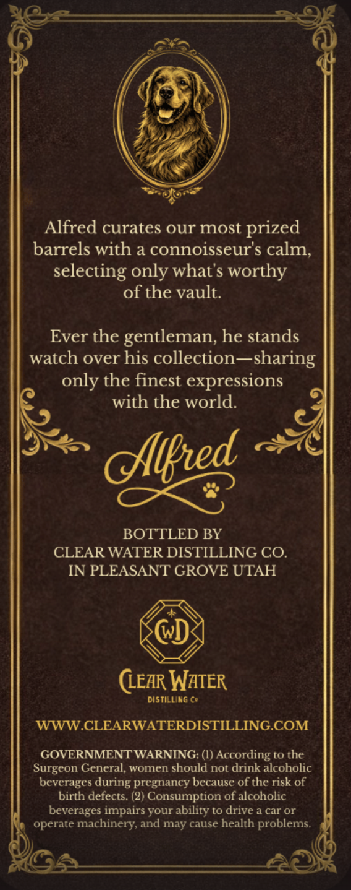
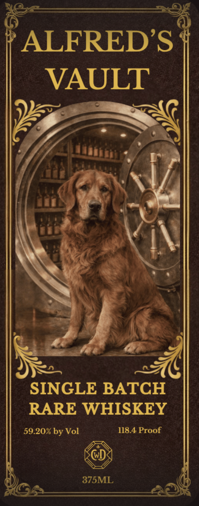
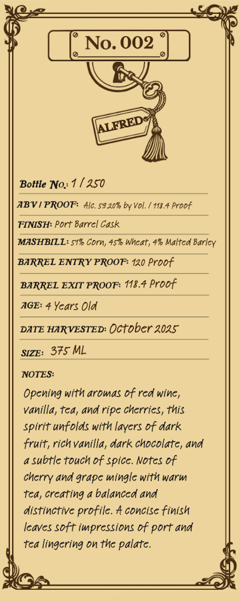

# TTB COLA Label Images - TTBID 26213001000073

**Brand Name:** ALFRED'S VAULT

**Issue Date:** 08/14/2026

**Origin Code:** 45

**Product Class/Type:** 140

**Source:** [TTB Public COLA Registry](https://ttbonline.gov/colasonline/viewColaDetails.do?action=publicFormDisplay&ttbid=26213001000073)

## Label Images

### Back Label

### Front Label

### Label 3

## Extracted Label Text

*Text extracted via OCR - may contain errors*

**Detected Proof:** 118.4
**Detected Age:** 4 Years

### Back Label

Alfred curates our most
prized
barrels with a connoisseur's calm;
selecting only whats worthy
of the vault.
Ever the gentleman, he stands
watch over his collection -
sharing
only the finest expressions
with the world
dlikred
BOTTLED BY
CLEAR WATER DISTILLING CO
IN PLEASANT GROVE UTAH
(LEAR WATER
DISTILLING €e
WWW CLEARWATERDISTILLING COM
GOVERNMENT WARNING: (I) According t0 the
Surgeon General;,
women should not drink alcoholic
beverages during pregnancy because of the risk of
birth defects. (2) Consumption of alcoholic
beverages impairs your ability to drive a car or
operate machinery, and may cause health problems.

### Front Label

ALFREDS
VAULT
SINGLE BATCH
RARE WHISKEY
59.20% by Vol
118.4 Proof
375ML

### Label 3

No. 002
Bottle No: 1
250
ABV / PROOF:
#lc. 59 20% by Vol.
118.4 Proof
FINISH: Port Barrel Cask
MASHBILL: 51% Corn; 45h Wheat, 4% Malted Barley
BARREL ENTRY PROOF: 120 Proof
BARREL EXIT PROOF: 118.4 Proof
AGE: 4 Years Old
DATE HARVESTED:
October 2025
SIZE:
375 ML
NOTES:
Opening with aromas Df red wine,
Vanilla, tea, and ripe cherries, this
spirit unfolds with layers Df dark
fruit; rich Vanilla, dark chocolate, and
subtle touch Df spice. Notes Df
and grape mingle with warm
tca, creating a balanced and
distinctive profile. # concise finish
leaves soft iwpressions Df port and
tea lingering on thc palate.
AALFREDe
cherry
