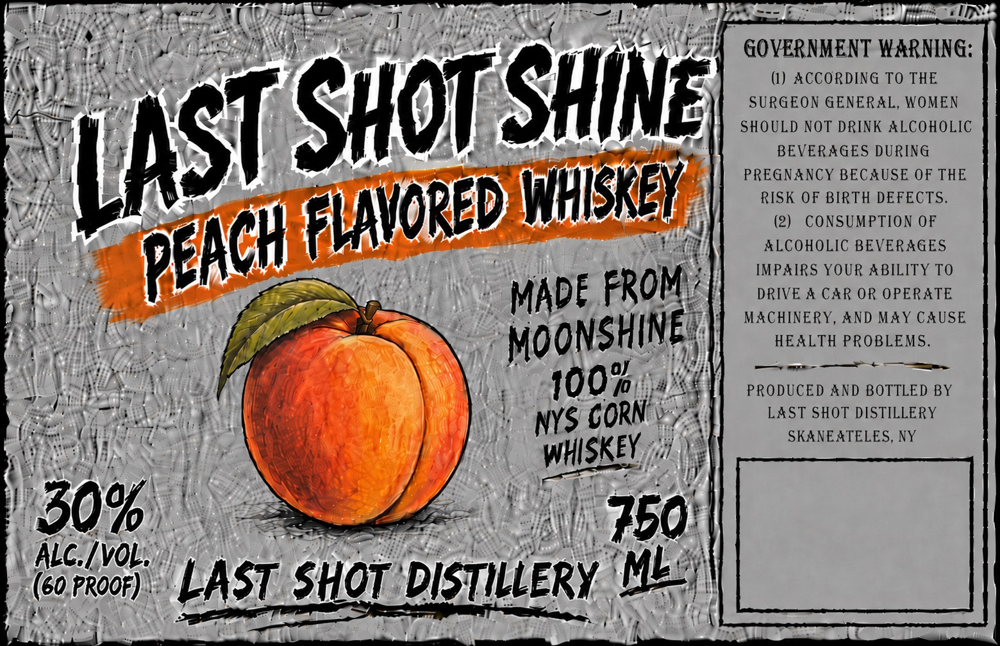

# TTB COLA Label Images - TTBID 26214001000103

**Brand Name:** LAST SHOT SHINE

**Fanciful Name:** PEACH FLAVORED WHISKEY

**Issue Date:** 08/24/2026

**Origin Code:** 02

**Product Class/Type:** 149

**Source:** [TTB Public COLA Registry](https://ttbonline.gov/colasonline/viewColaDetails.do?action=publicFormDisplay&ttbid=26214001000103)

## Label Images

### Label 1

## Extracted Label Text

*Text extracted via OCR - may contain errors*

### Label 1

MY Ns i Ag RO ae ANG TAG Bd Medea me LON) NLP or tee Bie ON ERSTE ae; ese s
iis ad Aye cea | WA to poly fi mye a wy dig 4g iz2dh GOVERNMENT WARNING:
i\\ fF, poe cayake AA ae ; { (at 4 - () ACCORDING TO THE
Ni ie eae ’ . SD \ M){ SURGEON GENERAL, WOMEN
a - Re : | SHOULD NOT DRINK ALCOHOLIC
poky Bs ws NS IL 4! CA RSet Soe sa Ag BEVERAGES DURING
etl iv ve < "aA" PREGNANCY BECAUSE OF THE
aa Vi | D WHISK RISK OF BIRTH DEFECTS.
NESS epi SOO 8 LA ‘ tinct | (2) CONSUMPTION OF
ME ea ean ALCOHOLIC BEVERAGES
Neue Cha vies IMPAIRS YOUR ABILITY TO
2 i, Ms a i ane “ MADE FROM’ 4 DRIVE A CAR OR OPERATE
Cy | Gu ay WYPRFE GV] MACHINERY, AND MAY CAUSE
RAs s tl # “MOONSHINE: HEALTH PROBLEMS.
AI i Ht Ab D.. i Sy n'y 1007) 1%e PRODUCED AND BOTTLED BY
of Vance y nyS CORN". LAST SHOT DISTILLERY
Sire ; Silla Wey : KEY Biter SKANEATELES, NY
(MAAS 2 a ; eS we Oe |i
1h, OP ce thive 2 Ae a ey FY
i 50% See | 780!
| (corroor). LAST SHOT DISTILLERY "="
