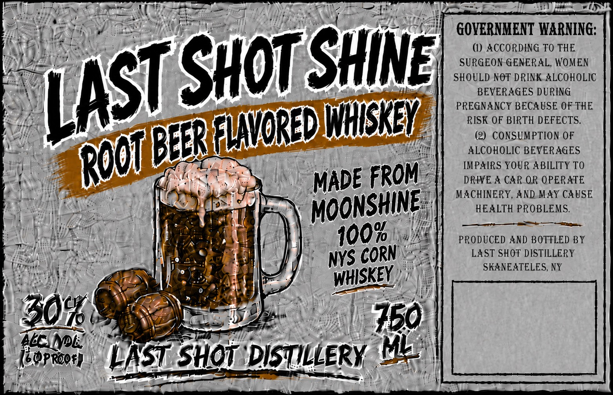

# TTB COLA Label Images - TTBID 26214001000104

**Brand Name:** LAST SHOT SHINE

**Fanciful Name:** ROOT BEER FLAVORED WHISKEY

**Issue Date:** 08/21/2026

**Origin Code:** 02

**Product Class/Type:** 149

**Source:** [TTB Public COLA Registry](https://ttbonline.gov/colasonline/viewColaDetails.do?action=publicFormDisplay&ttbid=26214001000104)

## Label Images

### Label 1

## Extracted Label Text

*Text extracted via OCR - may contain errors*

### Label 1

FUP ir sy ane Somme (dara a egies CE ao I LL
Trike 4 B Wg ep ial NI lS aot Ley Paik “471 GOVERNMENT WARNING:
TA; DMs ccalice tp F") —@ accorpina To THE
PUFA eo. . ~~ | SURGEON-GENERAL, WOMEN
as a AS SHOULD NOT DRINK ALCOHOLIC
Rava i \ 2) Ss celal BEVERAGES DURING
oh ' ioe m~ PH TTT lay) PREGNANCY BECAUSE OF THE
fe <r eal WHISKEY, j RISK OF BIRTH DEFECTS.
NH fee [ On y R SIAVORED 7 a (2) CONSUMPTION OF
wars 001 A") “4 z Rae ALCOHOLIC BEVERAGES
Bey ane A cig es 4 iL] IMPAIRS YOUR ABILITY TO
5 Nea R Li Nara |), i MADE FROM DRIVE A CAR OR OPERATE
ON eee 1 gl ae YF) ay a “v4 MACHINERY, AND-MAY CAUSE
eal Sue ia ideas \. MOONSHINE: HEALTH PROBLEMS.
Sie eum) | 3 \ | ee
TA tia ogee (GGA AS & 100% Ss PRODUCED AND BOTTLED BY
Telli, Wea eat! Pie oi | 2 NYS CORN ares LAST SHOT DISTILLERY
aie tae pee: Be if WHISKEY). , SKANEATELES, NY
Ay Besy)) Haye yt Se Penman) mil? 7 it |e
|! BOK: Z "(EN a Oe A eae | aie
| 304 MR ore se | 760)
denne ap
fl } [ee ” 3 iF 4 — ss. By)
fermen LAST SHOT DIsTILLERY HE |
