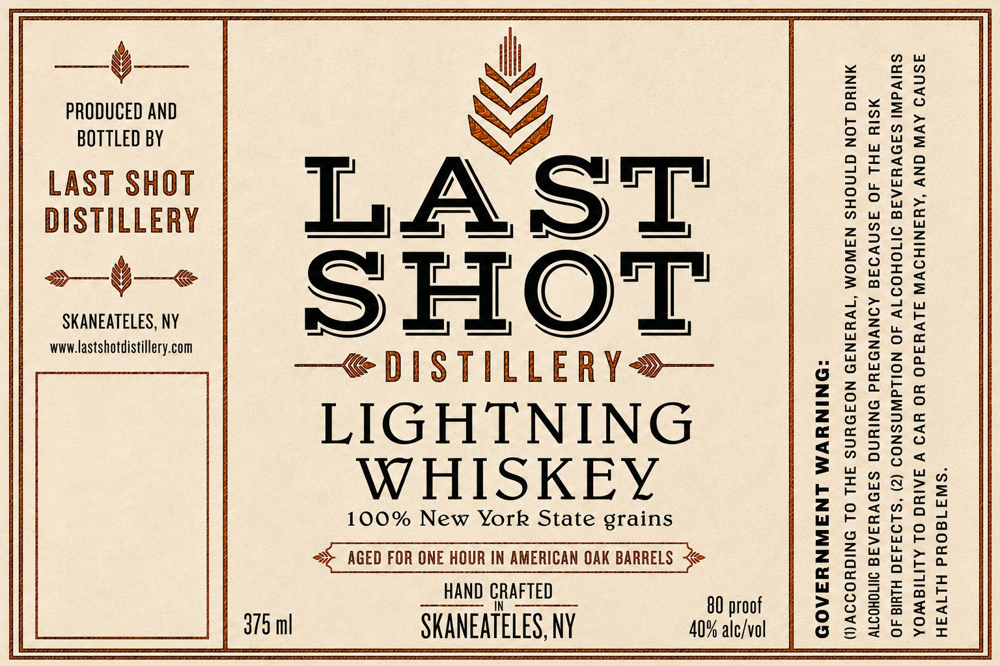

# TTB COLA Label Images - TTBID 26214001000105

**Brand Name:** LAST SHOT DISTILLERY

**Fanciful Name:** LIGHTNING WHISKEY

**Issue Date:** 08/24/2026

**Origin Code:** 02

**Product Class/Type:** 140

**Source:** [TTB Public COLA Registry](https://ttbonline.gov/colasonline/viewColaDetails.do?action=publicFormDisplay&ttbid=26214001000105)

## Label Images

### Label 1

## Extracted Label Text

*Text extracted via OCR - may contain errors*

**Detected Proof:** 80

### Label 1

“SINZ190Yd HLIV4H

ASNVO AVIN GNV ‘AYANIHOVW 3LVY4d0 HO YV9 V JAINC OL ALITIGWOA
SUIVdWI SADVYSARE IITOHOO TV 40 NOILAWNSNOO (2) “SL94440 HLula 40
MSIY JHL JO ASNVIAG AONVNDAYd ONINYNG SADVYSAAA JINOHOITV
MNIYG LON GINOHS NAWOM “1V¥4N39 NOJDUNS FHL OL SNIGUOIOV()

“ONINYUVM LNAWNUYFAOD

80 proof
40% alc/vol

ais

cE:

SHOT

LS
Leeda gn it

v

HAND GRAFTED
SKANEATELES, NY

WHISKEY

n
S
3
ial
io
y
©
5
a
n
o
8
Pal
3
o
Z
&
fo)
(e)
=

LIGHTNING

=~ AGED FOR ONE HOUR IN AMERICAN OAK BARRELS

PRODUCED AND
BOTTLED BY
LAST SHOT
DISTILLERY

SKANEATELES, NY
www.lastshotdistillery.com
