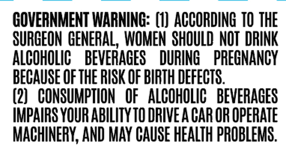
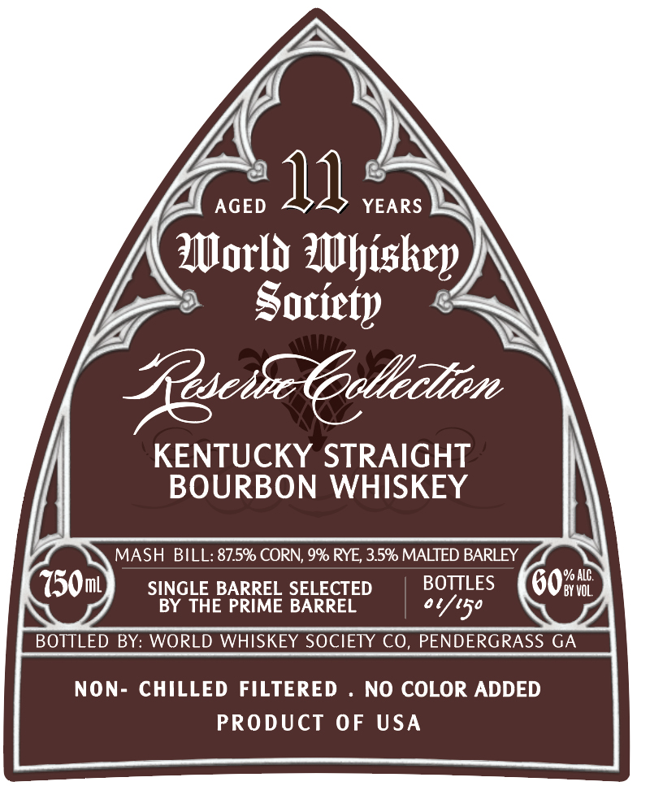

# TTB COLA Label Images - TTBID 26215001000090

**Brand Name:** WORLD WHISKEY SOCIETY

**Issue Date:** 08/10/2026

**Origin Code:** 08

**Product Class/Type:** 101

**Source:** [TTB Public COLA Registry](https://ttbonline.gov/colasonline/viewColaDetails.do?action=publicFormDisplay&ttbid=26215001000090)

## Label Images

### Back Label

### Front Label

## Extracted Label Text

*Text extracted via OCR - may contain errors*

### Back Label

GOVERNMENT WARNING: (1}  ACCORDING TO THE
SURGEON GENERAL, WOMEN SHOULD NOT DRINK
ALCOHOLIC
BEVERAGES
DURING
PREGNANCY
BECAUSE €F THE RISK OF BIRTH DEFECTS.
(2)   CONSUMPTION   OF   ALCOHOLIC  BEVERAGES
IMPAIRS YOUR AbiLITYTO DRIVE A GAR OR OpERATE
MACHINERY; AND May CAUSE HEALTH PROBLEMS:.

### Front Label

YS

oa

an

ce

ly

YA AGED

YEARS IN

World Whiskey

Soriety

A\

" GuchcClliln

KENTUCKY STRAIGHT

BOURBON WHISKEY

MASH BILL: 87.5% CORN, 9% RYE, 3.5% MALTED BARLEY

SINGLE BARREL SELECTED

BOTTLES

BY THE PRIME BARREL

o Ytso

BOTTLED BY: WORLD WHISKEY SOCIETY CO, PENDERGRASS GA

NON- CHILLED FILTERED . NO COLOR ADDED

PRODUCT OF USA
