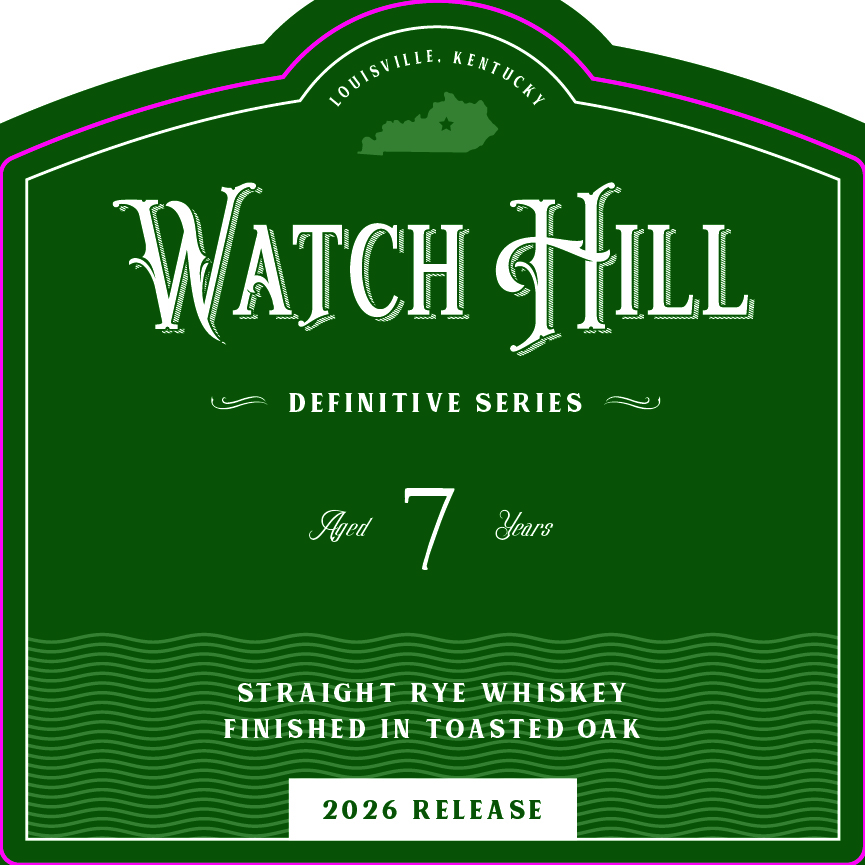
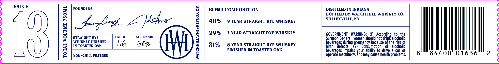

# TTB COLA Label Images - TTBID 26215001000181

**Brand Name:** WATCH HILL

**Fanciful Name:** DEFINITIVE SERIES - STRAIGHT RYE WHISKEY FINISHED IN TOASTED OAK

**Issue Date:** 08/10/2026

**Origin Code:** 22

**Product Class/Type:** 102

**Source:** [TTB Public COLA Registry](https://ttbonline.gov/colasonline/viewColaDetails.do?action=publicFormDisplay&ttbid=26215001000181)

## Label Images

### Front Label

### Label 2

## Extracted Label Text

*Text extracted via OCR - may contain errors*

**Detected Proof:** 80
**Detected Age:** 9 Years

### Front Label

Wazch & Hill
DEFINITIVE
SERIES
Ylyed
Years
STRAIGHT RYE WHISKEY
FINISHED IN TOASTED OAK
2026 RELEA SE
E,
Kentucky
10 UISV

### Label 2

BATCH

TOTAL VOLUME 750ML

FOUNDERS

STRAIGHT RYE PROOF . BY VOL.
WHISKEY FINISHED
IN TOASTED OAK l I6 58%

NON-CHILL FILTERED

WATCHHILLWHISKEYCO.COM

BLEND COMPOSITION

40%
29%
31%

9 YEAR STRAIGHT RYE WHISKEY

7 YEAR STRAIGHT RYE WHISKEY

8 YEAR STRAIGHT RYE WHISKEY
FINISHED IN TOASTED OAK

DISTILLED IN INDIANA
BOTTLED BY WATCH HILL WHISKEY CO.
SHELBYVILLE, KY

GOVERNMENT WARNING: (1) According to the
Surgeon General, women should not drink alcoholic
beverages during pregnancy because of the risk of
birth defects. 16) Consumption of alcoholic
beverages impairs your ability to drive a car or
operate machinery, and may cause health problems.

8 {|

01636 2
