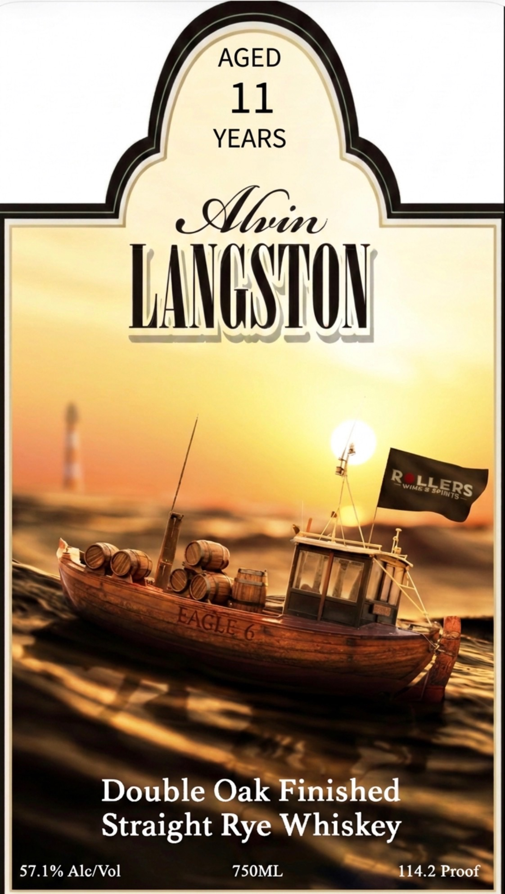
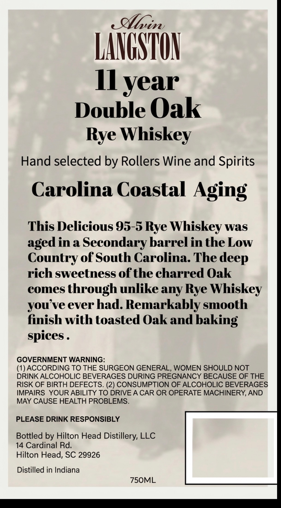

# TTB COLA Label Images - TTBID 26215001000278

**Brand Name:** ALVIN LANGSTON

**Fanciful Name:** DOUBLE OAK FINISHED

**Issue Date:** 08/12/2026

**Origin Code:** 41

**Product Class/Type:** 102

**Source:** [TTB Public COLA Registry](https://ttbonline.gov/colasonline/viewColaDetails.do?action=publicFormDisplay&ttbid=26215001000278)

## Label Images

### Label 1

### Label 2

## Extracted Label Text

*Text extracted via OCR - may contain errors*

**Detected Proof:** 114.2
**Detected Age:** 11 Years

### Label 1

AGED
11
YEARS
_eluim
LaGSTU
R
6
Double Oak Finished
Straight
Whiskey
57.1% Alc/Vol
7S0ML
114.2 Proof
LLERS
Ivimea Soiits
EAGEE
7
Rye

### Label 2

dllrin
LANGSHUN
II year
Double Oak
Rye Whiskey
Hand selected by Rollers Wine and Spirits
Carolina Coastal Aging
This Delicious 95-5 Rye Whiskey was
in a Secondary barrel in the Low
Country of South Carolina The
rich sweetness of the charred Oak
comes
through unlike any Rye Whiskey
you ve ever had. Remarkably smooth
finish with toasted Oak and baking
spices _
GOVERNMENT WARNING:
(1) ACCORDING TO THE SURGEON GENERAL, WOMEN SHOULD NOT
DRINK ALCOHOLIC BEVERAGES DURING PREGNANCY BECAUSE OF THE
RISK OF BIRTH DEFECTS. (2) CONSUMPTION OF ALCOHOLIC BEVERAGES
IMPAIRS   YOUR ABILITY TO DRIVE A CAR OR OPERATE MACHINERY, AND
MAY CAUSE HEALTH PROBLEMS.
PLEASE DRINK RESPONSIBLY
Bottled by Hilton Head Distillery, LLC
14 Cardinal Rd.
Hilton Head, SC 29926
Distilled in Indiana
7SOML
aged
deep
