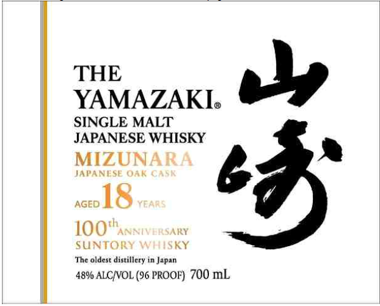
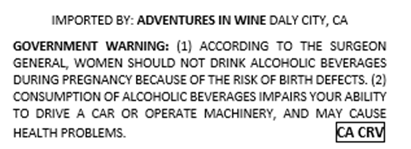

# TTB COLA Label Images - TTBID 26215001000281

**Brand Name:** THE YAMAZAKI

**Issue Date:** 08/11/2026

**Origin Code:** 59

**Product Class/Type:** 118

**Source:** [TTB Public COLA Registry](https://ttbonline.gov/colasonline/viewColaDetails.do?action=publicFormDisplay&ttbid=26215001000281)

## Label Images

### Label 1

### Label 2

## Extracted Label Text

*Text extracted via OCR - may contain errors*

**Detected Proof:** 96
**Detected Age:** 18 Years

### Label 1

THE
YAMAZAKI:
SANGNESEAHISKY
0
MIZUNARA
JAPANLSE OAL C
AGED
18
YEARS
100 hANNivERsARY
SUNTORY WSkY
The oldest distillery in Japan
48% ALCIVOL (96 PROOF) 700 mL

### Label 2

IMPORTED BY: ADVENTURES IN WINE DALY CITY, CA
GOVERNMENT
WARNING: (1) ACCORDING To THe SURGEON
GENERAL WOMEN SHOULD NoT DRINK ALCOHOLIC BEVERAGES
DURING PREGNANCY BECAUSE OF THE RiISK OF BIRIH DEFECTS: (2)
CCNSUMPTION OF ALCOHOLIC BEVERAGES IMPAIRS YOUR ABILITY
To DRIVE A CAR OR CPERATE MACHINERY, AND MAY CAUSI
HZALTH PROBLEMS:
KA CRV
