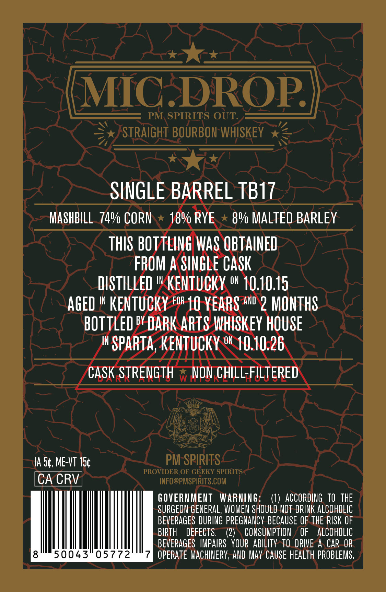
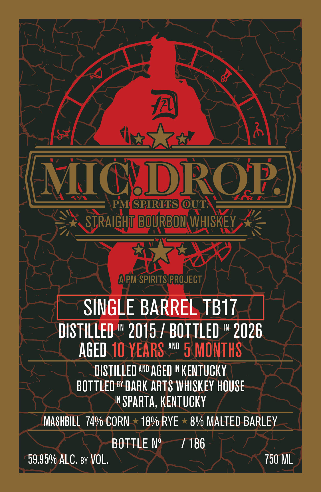

# TTB COLA Label Images - TTBID 26215001000286

**Brand Name:** MIC DROP

**Issue Date:** 08/20/2026

**Origin Code:** 22

**Product Class/Type:** 101

**Source:** [TTB Public COLA Registry](https://ttbonline.gov/colasonline/viewColaDetails.do?action=publicFormDisplay&ttbid=26215001000286)

## Label Images

### Back Label

### Front Label

## Extracted Label Text

*Text extracted via OCR - may contain errors*

**Detected Age:** 10 Years

### Back Label

MIC DROP
PM SPIRITS OUT:
STRAIGHT BOURBON WHISKEY
SINGLE BARREL TBI7
MASHBILL   74% COPN
18V RYE
89 MALTED BARLEY
THIS BOTTLING WAS OBTAINED
FROM A SINGLE CASk
diStILLeD
IN
KENTUCKY o" 10.10.15
ageD
IN
KENTUCKY For 10 YEARS awD 2 MONTHS
bOttLed by DARK ARTS WHISKeY HOUSE
IN
SPARTa; KENTUCKY ow 10.10.26
CaSk STRENGTH
W
NON chILL-FILTERED
IA 54, ME-VT 15c
PM SPIRITS _
PROVIDER OF GEEKY SPIRITS
CA CRV
INFO@PMSPIRITS.COM
GOVERNMEUT
WARNING=
ACCORDING   TO   tHE
SURGEON GENERAL, WOMEN SHOULD NOT DRINK ALcOHOLIc
BEVERAGES DURING PREGNANCY BECAUSE OF THE RISK OF
BIPTH
DEFECTS;
(2)
CONSUMPTION
OF
ALCOHOLIC
BEVERAGES  IMPAIRS  YOUR  aBILITy  TO   DRIVE A CAR OR
50043"05772
OPERATE MachINERY, AND May CAUSe HEALTh PROBLEMS.

### Front Label

MICDROP
PM GPIRITS OUT:
STRAIGHT BOURBOM WHISKEY
APM SPIRITSPROJECT
SINGLE BARREL TBI7
DIS TILLED
IN
2015 / BOTTLED
IN
2026
AGED 10 YEARS
ANd
5 MONTHS
DISTILLED AND AGED I KENtuCKY
BOTTLED bY DARK ARTS WHISKeY HOUSE
IN
SPARTa; KENTuCKY
MASHBILL  740 CORN
189 RYE
89 MALTED BARLEY
BOTTLE N'
186
59,959 ALC. By VOL.
750 ML
