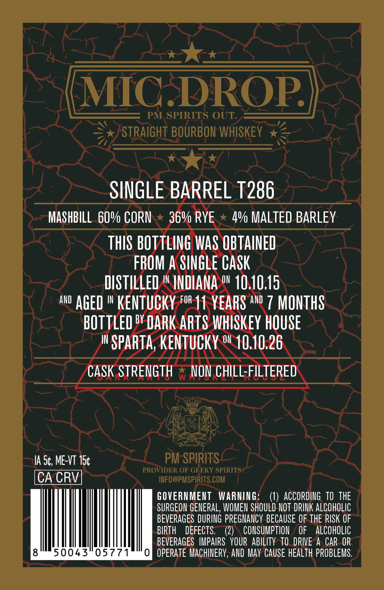
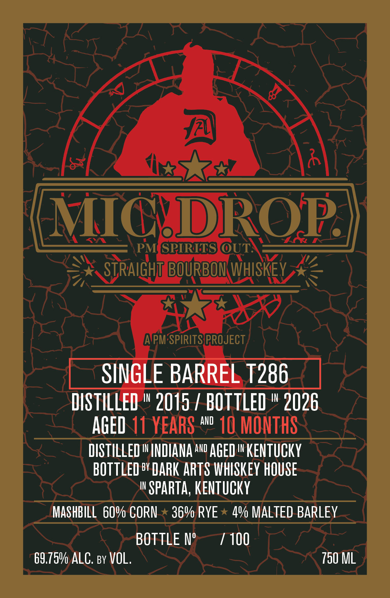

# TTB COLA Label Images - TTBID 26215001000292

**Brand Name:** MIC DROP

**Issue Date:** 09/02/2026

**Origin Code:** 22

**Product Class/Type:** 101

**Source:** [TTB Public COLA Registry](https://ttbonline.gov/colasonline/viewColaDetails.do?action=publicFormDisplay&ttbid=26215001000292)

## Label Images

### Back Label

### Front Label

## Extracted Label Text

*Text extracted via OCR - may contain errors*

**Detected Age:** 11 Years

### Back Label

MIC DROP
PM SPIRITS OUT:
STRAIGHT BOURBON WHISKEY
SINGLE BARREL T286
MASHBILL 60% CORN
369 RYE
4Y MALTED BARLEY
THIS BOTTLING WAS OBTAINED
FROM A SINGLE CASk
DISTILLED
IN
INDIANA o 10.10.15
and
aGeD I KENTUCKY for 11 YEARS AwD 7 MONTHS
bOTTLeD by DARK ARTS whISkey HOUSE
IN
SPARTa; KENTUCKY ow 10.10.26
CaSk STRENGTH
W
NON chILL-FILTERED
IA 54, ME-VT 15c
PM SPIRITS _
PROVIDER OF GEEKY SPIRITS
CA CRV
INFO@PMSPIRITS.COM
GOVERNMEUT
WARNING=
ACCORDING   TO   tHE
SURGEON GENERAL, WOMEN SHOULD NOT DRINK ALcOHOLIc
BEVERAGES DURING pEGNANCY BECAUSE OF THE RISK OF
BIPTH
DEFECTS;
(2)
CONSUMPTION
OF
ALCOHOLIC
BEVERAGES  IMPAIRS  YOUR  aBILITy  TO   DRIVE A CAR OR
50043"05771
OPERATE MachINeRY, AND May CAUSe HEAlTh PROBLEMS.

### Front Label

MICDROP
PM GPIRITS OUT:
STRAIGHT BOURBOM WHISKEY
APM SPIRITSPROJECT
SIIGLE BARREL T286
DISTILLED
IN
2015 / BOTTLED
IN
2026
AGeD 11 YEARS AwD 10 MONTHS
DISTILLED IINDIANA AwD AGED I KeNtuCKY
BOTTLED BY DARK ARTS VHISKeY HOUSE
IN
SPARTa; KENTuCKY
MASHBILL 6Ov CORN
369 RYE
4Y MALTED BARLEY
BOTTLE N'
100
69.759 ALC. By VOL.
750 ML
