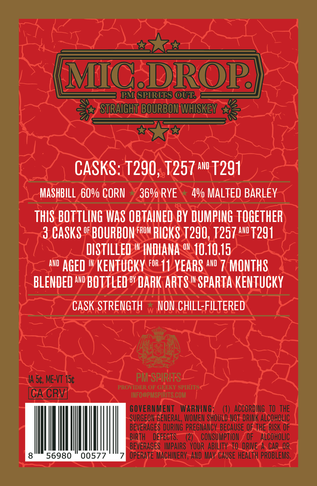
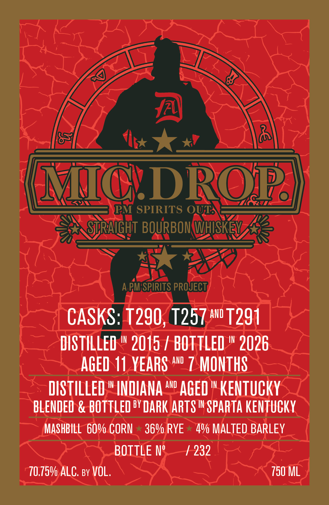

# TTB COLA Label Images - TTBID 26215001000313

**Brand Name:** MIC DROP

**Issue Date:** 08/13/2026

**Origin Code:** 22

**Product Class/Type:** 101

**Source:** [TTB Public COLA Registry](https://ttbonline.gov/colasonline/viewColaDetails.do?action=publicFormDisplay&ttbid=26215001000313)

## Label Images

### Back Label

### Front Label

## Extracted Label Text

*Text extracted via OCR - may contain errors*

**Detected Age:** 11 Years

### Back Label

MC-DROP
PM GPIRITS OUR
STRAIGHT BOURBON WHISKEV
CASKS: T290, T257 aw" T291
MASHBILL 60v CORN
369 RYE
4V MALTED BARLEY
THIS BOTTLING WAS OBTAINED BY DUMPING tOGETHER
3 CASKS oF BOURBON FRoM RICKS
T290, T257
AND
T291
DISTILLED
IN
INDIANA o 10.10.15
aND
Aged
IN
kentuCKY For 11 YEARS AND 7 MONTHS
BLENDED AnD BOTTLED by DARK ARTS I SPARTA kentuCKY
CASK STRENGTH
NON CHILL-FILTERED
A 50, ME-VT 15c
PM-SPIRITS-
PROVIDER OF GEEKY SPIRITS
CA CRV
INFO@PMSPIRITS COM
GOVERNMENT
WARNING;
ACCORDING   TO THE
SURGEON GENERAL, WOMEN SHOuLD-NOT-DRINK ALCOHOLIc
BEVERAGES DURING PREGNANCV_BECAUSE OF ThE RISK OF
BIRTH
DEFECTS;
(2)
CONSUMPTHON
OF
alCOHOLIC
BEVERAGES   IMPAIRS   YOUR  ABILITYATO'DRIVE As CAR_ORC
8
56980
00577
OPERATE MACHINERV , AND Mav Cause HeALTh PROBLEMS,

### Front Label

MICDROP
PM SPIRITS OUT
STRAIGHT BOURBOM WHISKEY
A PMSPIRITS PROJECT
CASKS: T290, T257 AnD T291
DISTILLED
IN
2015 / BOTTLED
IN
2026
AGED 11 YEARS An" 7 MONTHS
DISTILLED
IN
INDIANA
ANd
AGED
IN
KENtuCKY
BLENDED & BOTTLED BY DARK ARTS I SPARTA kentuckY
MASHBILL 60v CORN
36v RYE
4v MALTED BARLEY
BOTTLE N"
232
70,759 ALC: By VOL.
750 ML
