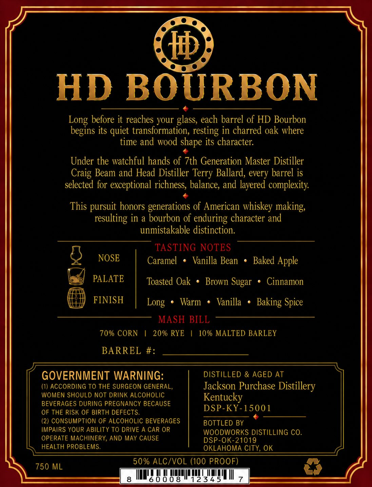
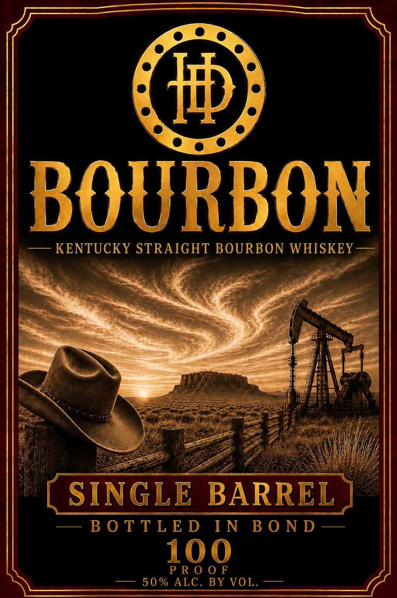

# TTB COLA Label Images - TTBID 26215001000356

**Brand Name:** HD BOURBON

**Issue Date:** 08/17/2026

**Origin Code:** 37

**Product Class/Type:** 111

**Source:** [TTB Public COLA Registry](https://ttbonline.gov/colasonline/viewColaDetails.do?action=publicFormDisplay&ttbid=26215001000356)

## Label Images

### Back Label

### Front Label

## Extracted Label Text

*Text extracted via OCR - may contain errors*

*1 image(s) excluded: text did not meet readability threshold*

**Detected Proof:** 100

### Back Label

HD BOURBON
Long before it reaches your glass, each barrel of HD Bourbon
begins its
transformation, resting in charred oak where
time and wood shape its character:
Under the watchful hands of 7th Generation Master Distiller
Craig Beam and Head Distiller
Ballard, every barrel is
selected for exceptional richness, balance, and layered complexity
This pursuit honors generations of American whiskey making;
resulting in a bourbon of enduring character and
unmistakable distinction:
TASTING NOTES
NOSE
Caramel
Vanilla Bean
Baked Apple
PALATE
Toasted Oak
Brown
Cinnamon
FINISH
Warm
Vanilla
Spice
MASH BILL
70% CORN
20% RYE
10 % MALTED BARLEY
BARREL #:
GOVERNMENT WARNING:
DISTILLED & AGED AT
(1) ACCORDING TO THE SURGEON GENERAL,
Jackson Purchase Distillery
WOMEN SHOULD NOT DRINK ALCOHOLIC
Kentucky
BEVERAGES DURING PREGNANCY BECAUSE
OF THE RISK OF BIRTH DEFECTS.
DSP-KY-1500 1
(2) CONSUMPTION OF ALCOHOLIC BEVERAGES
BOTTLED BY
IMPAIRS YOUR ABILITY TO DRIVE A CAR OR
WOODWORKS DISTILLING CO.
OPERATE MACHINERY, AND MAY CAUSE
DSP-OK-21019
HEALTH PROBLEMS.
OKLAHOMA CITY, OK
50% ALC/VOL (100 PROOF)
750 ML
60008
12345
quiet
Terry
Sugar
Long
Baking
