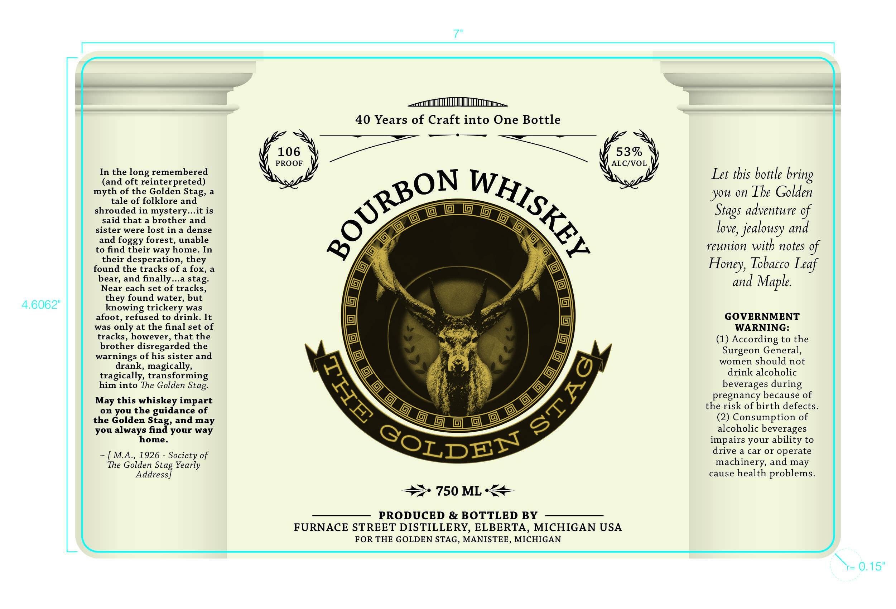

# TTB COLA Label Images - TTBID 26215001000447

**Brand Name:** THE GOLDEN STAG

**Issue Date:** 08/11/2026

**Origin Code:** 06

**Product Class/Type:** 141

**Source:** [TTB Public COLA Registry](https://ttbonline.gov/colasonline/viewColaDetails.do?action=publicFormDisplay&ttbid=26215001000447)

## Label Images

### Label 1

## Extracted Label Text

*Text extracted via OCR - may contain errors*

**Detected Proof:** 106
**Detected Age:** 40 Years

### Label 1

40 Years of Craft into One Bottle
106
53%
PROOF
ALCIVOL
In the
remembered
Let this bottle
(and oft reinterpreted)
of the Golden
you on The Golden
tale of folklore and
shrouded in mystery
.it is
adventure %
said that a brother and
sister were lost in
dense
jealousy and
and
forest,
unable
to find their way home_
In
reunion with notes %
their desperation,
Honey; Tobacco Leaf
found the tracks of a
bear; and finally
stag
and Maple.
Near each set of tracks ,
found water, but
4.6062"
knowing trickery was
afoot,
refused to drink
It
GOVERNMENT
was only at the final set of
WARNING:
tracks
however, that the
(1) According to the
brother disregarded the
warnings of his sister and
Surgeon General,
drank
women
should not
magically
tragically,
trans
forming
drink alcoholic
him into The Golden
beverages during
pregnanc
because of
this whiskey impart
the risk of birth defects.
on
the guidance of
the Golden
(2) Consumption of
you always
Sindyoud way
alcoholic beverages
home
impairs your ability to
drive a car
operate
MA
1926
Society of
The Golden Stag Yearly
machinery, and may
Address
cause health
problems_
750 ML
PRODUCED & BOTTLED BY
FURNACE STREET DISTILLERY, ELBERTA, MICHIGAN USA
FOR THE GOLDEN STAG, MANISTEE, MICHIGAN
f=
0.15"
bring
long
BOURBON
WHISKEY
myth
Stag,
Stags
love,
foggy
they
fox,
they
Stag:
May
you
and
may
or
