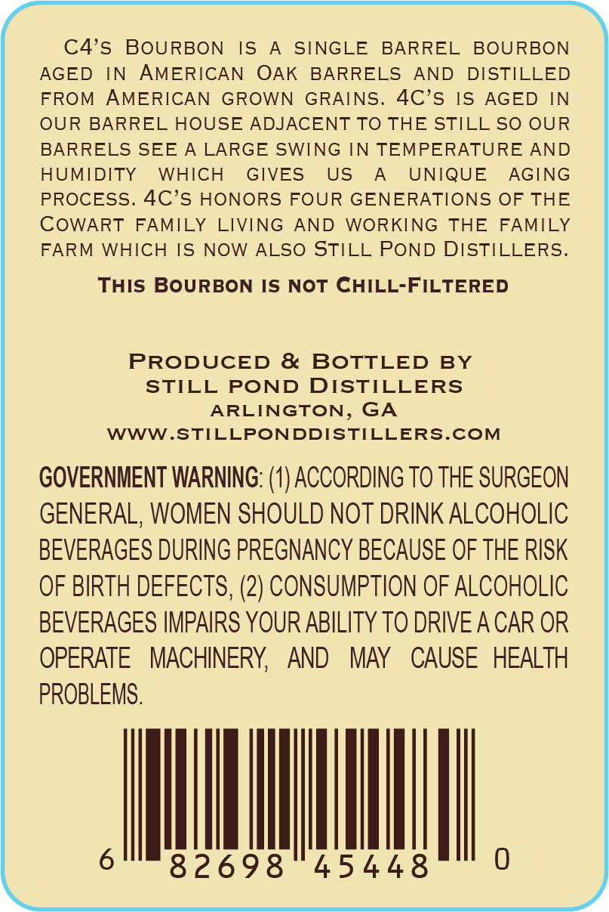
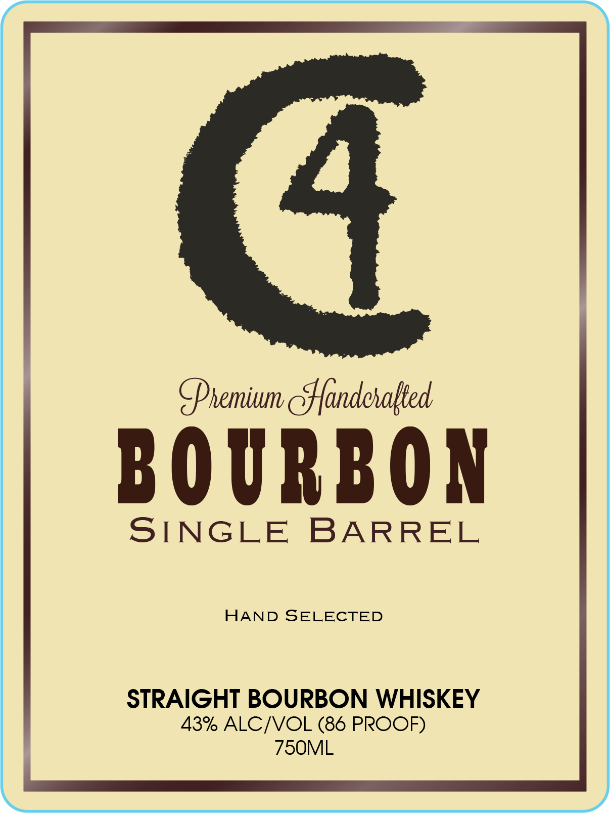

# TTB COLA Label Images - TTBID 26215001000480

**Brand Name:** C4

**Issue Date:** 08/10/2026

**Origin Code:** 08

**Product Class/Type:** 101

**Source:** [TTB Public COLA Registry](https://ttbonline.gov/colasonline/viewColaDetails.do?action=publicFormDisplay&ttbid=26215001000480)

## Label Images

### Back Label

### Front Label

## Extracted Label Text

*Text extracted via OCR - may contain errors*

**Detected Proof:** 86

### Back Label

C4's
BOURBON
IS
SINGLE
BARREL
BOURBON
AGED
IN
AMERICAN
OAK
BARRELS
AND
DISTILLED
FROM
AMERICAN
GROWN
GRAINS.
4C's
IS
AGED
IN
OUR BARREL HOUSE ADJACENT TO THE STILL SO OUR
BARRELS SEE
A LARGE SWING IN TEMPERATURE
AND
HUMIDITY
WHICH
GIVES
US
UNIQUE
AGING
PROCESS. 4C's HONORS FOUR GENERATIONS OF THE
COWART
FAMILY
LIVING
AND
WORKING
THE
FAMILY
FARM WHICH IS
NOW ALSO STILL POND DISTILLERS.
THIS BOURBON IS
NoT CHILL-FILTERED
PRODUCED &
BOTTLED
BY
STILL
POND
DISTILLERS
ARLINGTON,
GA
WWW.STILLPONDDISTILLERS.COM
GOVERNMENT WARNING: (0) ACCORDING TO THE SURGEON
GENERAL, WOMEN SHOULD NOT DRINK ALCOHOLIC
BEVERAGES DURING PREGNANCY BECAUSE OF THE RISK
OF BIRTH DEFECTS, (2) CONSUMPTION OF ALCOHOLIC
BEVERAGES IMPAIRS YOUR ABILITY TO DRIVEA CAR OR
OPERATE
MACHINERY
AND
MAY
CAUSE   HEALTH
PROBLEMS.
82698
45448

### Front Label

4
Shemium eHfandehalted
BO URBON
SINGLE
BARREL
HAND SELECTED
STRAIGHT BOURBON WHISKEY
43% ALCIVOL (86 PROOF)
75OML
