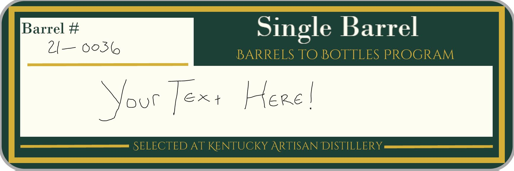
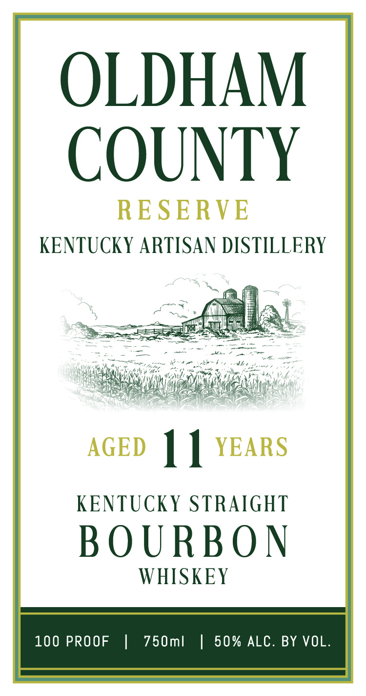

# TTB COLA Label Images - TTBID 26215001000489

**Brand Name:** KENTUCKY ARTISAN DISTILLERY

**Issue Date:** 08/10/2026

**Origin Code:** 22

**Product Class/Type:** 101

**Source:** [TTB Public COLA Registry](https://ttbonline.gov/colasonline/viewColaDetails.do?action=publicFormDisplay&ttbid=26215001000489)

## Label Images

### Back Label

### Front Label

### Label 3

## Extracted Label Text

*Text extracted via OCR - may contain errors*

*1 image(s) excluded: text did not meet readability threshold*

**Detected Proof:** 100

### Back Label

Barrel #
Single Barrel
2 _ 0o36
BARRELS TO BOTTLES PROGRAM
Text
Kere
SELECTED AT KENTUCKY ARTISAN DISTILLERY
ooC

### Front Label

OLDHAM

COUNTY

RESERVE

KENTUCKY ARTISAN DISTILLERY

acs

ie

cae

AGED | | YEARS

KENTUCKY STRAIGHT

BOURBON

WHISKEY

100 PROOF | 750ml | 50% ALC. BY VOL.
