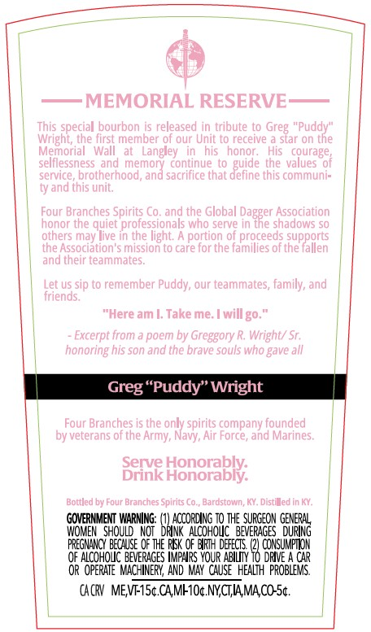
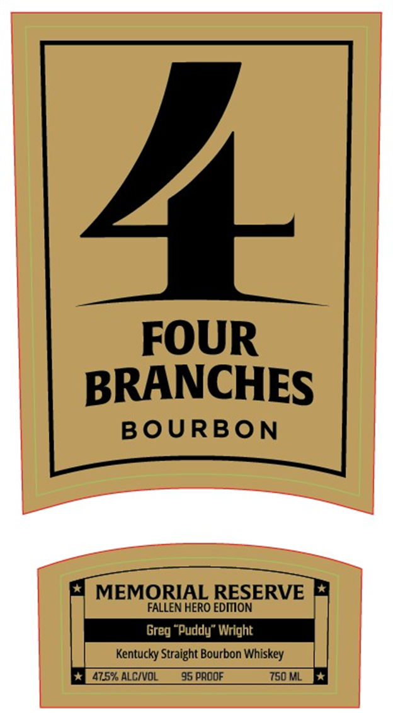
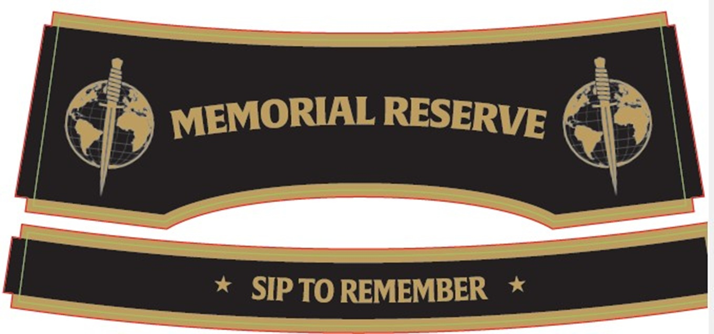

# TTB COLA Label Images - TTBID 26215001000498

**Brand Name:** FOUR BRANCHES

**Issue Date:** 08/10/2026

**Origin Code:** 22

**Product Class/Type:** 101

**Source:** [TTB Public COLA Registry](https://ttbonline.gov/colasonline/viewColaDetails.do?action=publicFormDisplay&ttbid=26215001000498)

## Label Images

### Back Label

### Label 1

### Label 3

## Extracted Label Text

*Text extracted via OCR - may contain errors*

*1 image(s) excluded: text did not meet readability threshold*

**Detected Proof:** 95

### Back Label

MEMORIAL RESERVE
special bourbon is released
tribute to Greg "Puddy"
Wrighl, the first member of our Unit to receive
slar on the
Memorial
Wall
Langley
his
honor;
His
courage
selllessness
and memoni
contnue
the  Values
of
service, brotherhood, and sacrifice that define this communi=
ty and this unit;
Four Branches Spirits Co, and the Global
! Daxrer
Association
honor the quiet professionals who serve in
shadows so
others may live in the light: A portion 0f proceeds supports
Lhe Association"$ mission t0 care for the families of the fallen
and their teammates;
Let us sip to remember Puddy; our teammates, family, and
Griends;
"Here am |. Take me;
will go.
Excerpt from
poem by
'Greggory R. Wright/ Sr,
honoring his son and the brave souls who gave all
Greg"Puddy" Wright
Four Branches is the only spirits company founded
by veterans of the Army, Navy, Air Force, and Marines.
Beie Honorably;
Bottled by Four Branches Spirits Co_
Bardstowm, KY, Distilled in KY;
GOVERMMENT WARNING:
BraccoaicoFoD HEEVerGGES GeueG
WOMEN   ShOULD   NOT
ALCoHouc ' BeveraGes ^ during
PREGNHNCY because OF The REK OF Erty Defects
CONSUMPTKON
QF ALCoHoUC BEVERAGES HapAps VOuR ABILI
38 Bwve
CAR
OR OPERATE MACHINEFY,  AND MAY  cause   HEALTH  probLeMS.
CACRV MEVF-ISc CAMFIOc NYCTIAMACO-Sc
This
guide

### Label 1

1-
FOUR
BRANCHES
BoURBON
MEMORIAL RESERVE
FALLEN HERO EDIION
Greg "Puddy" Wright
Kentucky Straight Bourbon Whiskey
47.5% ALCIVOL
95 PAOOF
750 ML
