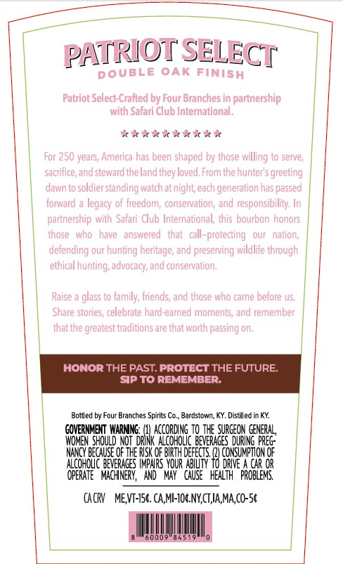
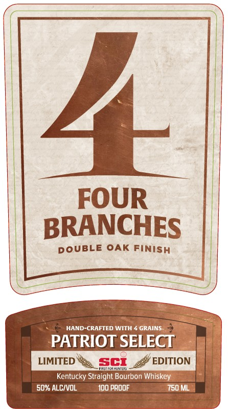
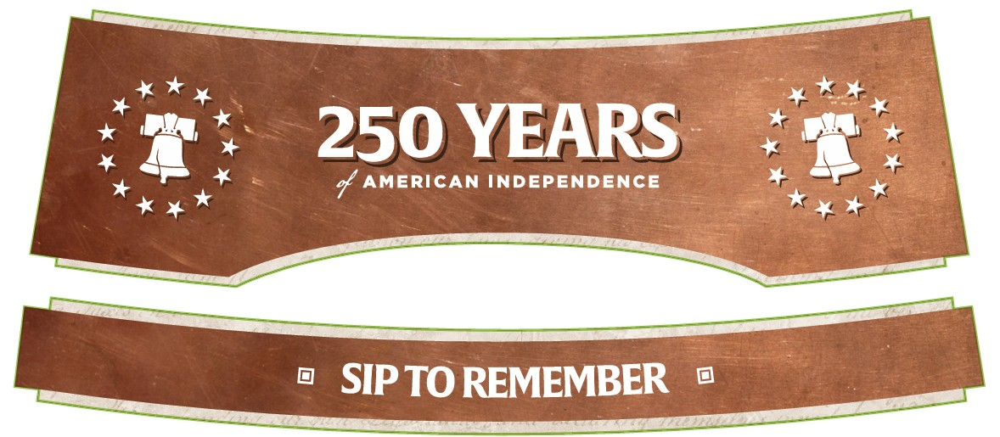

# TTB COLA Label Images - TTBID 26215001000502

**Brand Name:** FOUR BRANCHES

**Issue Date:** 08/10/2026

**Origin Code:** 22

**Product Class/Type:** 101

**Source:** [TTB Public COLA Registry](https://ttbonline.gov/colasonline/viewColaDetails.do?action=publicFormDisplay&ttbid=26215001000502)

## Label Images

### Back Label

### Label 1

### Label 3

## Extracted Label Text

*Text extracted via OCR - may contain errors*

**Detected Proof:** 100

### Back Label

PATRIOT SELECT
DOUBLE OAK FINISH
Patriot Select-Crafted by Four Branches in partnership
with Safari Club International .
For 250 years, America has been shaped by those willing to serve,
sacrifice;and steward the land they loved: From the hunter'$ greeting
dawnt0
soldier standing watch atnight each generation has passed
forward
legacy of freedom; conservation; and responsibilty: In
partnership with  Safari Club International; this bourbon honors
#hose  who   have   answered
tnat
call-protecting
Qur   nation;
defending our hunting heritage, and preserving wildlife through
ethical hunting; advocacy, and conservation,
Raise
glass to family; friends; and those who came before us:
Share stories; celebrate hard-earned moments; and remember
Lhat tne
traditions are tnat wortn passing on.
HONOR THE PAST. PROTECT THE FUTURE:
SiP TO ReMeMBER:
Botlled by Four Branches Spirits Co,
Bardstown, KY. Distilled In KY
GOVERNMENT  WARNNG:
according tQ_Tie SURCEON GEMERAL
WOMEN  SHOuLd NOT  DRINK  ALcoHoLIc BEVERAGES  DURING preG:
NAXCY BECAUSE OF THE RISK OF BIRTH DEFEC
CONSUMPTON €F
ALcohouc beveraces IpaRS  YOUR ABl_N"
DRIVe
CAR OR
OPERATE ` MLcHIneRY, ^ ANd
May ^ chuse ^ health  problens
CAcRV
MEVT-ISc CA,MI-TOGNY,CTIA,MA,co-5c
greatest)

### Label 1

)
FOUR
BRANCHES
DOUBLE OAK Finish
HAND-CRAFTED WITH
GRAINS
PATRIOT SELECT
LIMITED
Sct
EDITION
Kentucky
'Straight Bourbon Whiskey
50% ALCIvoL
Ido prddF
750 ML

### Label 3

250 YEARS
% AMERICAN INDEPENDENCE
SIP TO REMEMBER
