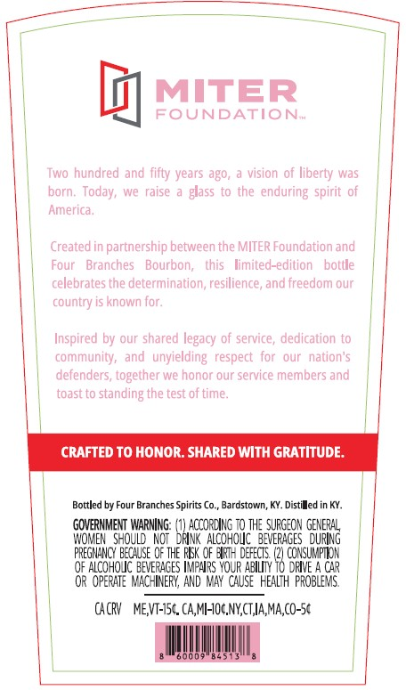
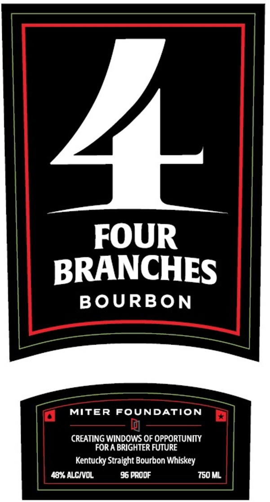
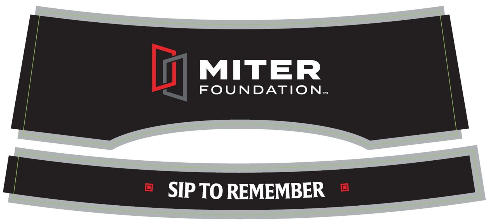

# TTB COLA Label Images - TTBID 26215001000520

**Brand Name:** FOUR BRANCHES

**Issue Date:** 08/10/2026

**Origin Code:** 22

**Product Class/Type:** 101

**Source:** [TTB Public COLA Registry](https://ttbonline.gov/colasonline/viewColaDetails.do?action=publicFormDisplay&ttbid=26215001000520)

## Label Images

### Back Label

### Front Label

### Label 3

## Extracted Label Text

*Text extracted via OCR - may contain errors*

*1 image(s) excluded: text did not meet readability threshold*

**Detected Proof:** 96

### Back Label

MITER
FOUNDATION-
Two hundred and fifty years ag0,
vision 0f
liberty was
porn;
Today;
e  raise
glass
to the enduring   spirit of
America
Created in partnership between the MITER Foundation and
Four
Branches
Bourbon;
his
limited-edition
celebrates the determination, resilience, and freedom our
country
known for;
Inspired by our shared legacy of service, dedication to
community,   and
xunyielding  respect  for
our  nation'5
defenders, together we honor our service members and
toascto
standing the test of time;
CRAFTED To HONOR: SHARED With GRATITUDE:
Bottled by Four Branches Spirits Co.
Bardstowan, KY. Distiled in KY:
GOVERNMENT WARNING:
BRXccoaizohoU THE_VeRAGeS
GUERG
WOMEN   should   NOt
AlCohOIC  3EVERAGES
PREgMHnCY Because OF the FEK oF Wpt=  defects
CONSUMPTLOK
QF ALCOHOJC BEVERACES Ieaps YouR ABIL
18 Ohven
C4R
OR   OPERATE  MIACHINERY, AND MAY  cauSe  HEALTH probleMs
CACPV   MEVT-7Sc. CA,ML-IOC,NYCTIA,MA,CO-5c
Els
botile

### Front Label

2
FOUR
BRANCHES
BOURBON
MITER
FOUNDATION
CREATING WINDOWS OF OPPORTUNITY
FOR A BRIGHTER FUTURE
Kentucky Stralght Bourbon Whiskey
48% ALCIVOL
96 PRODF
750 ML
