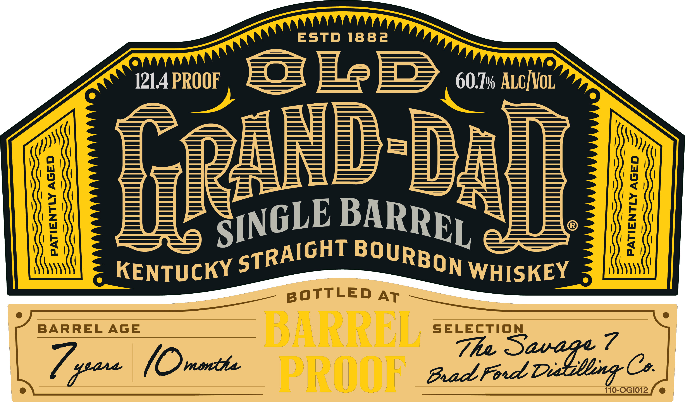
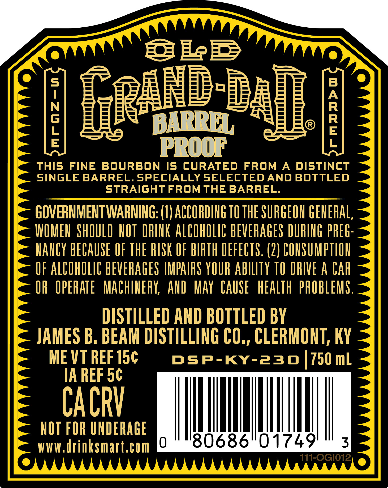
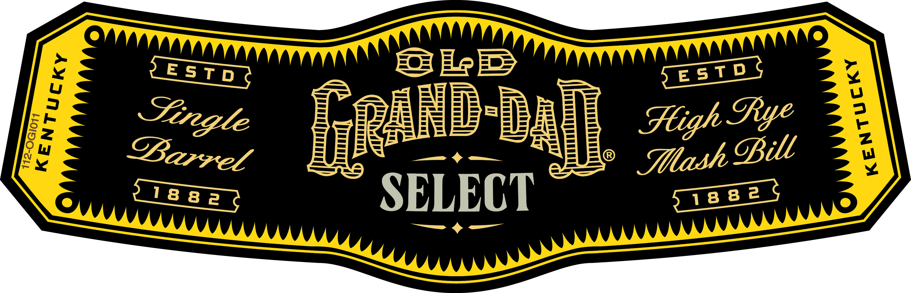

# TTB COLA Label Images - TTBID 26215001000579

**Brand Name:** OLD GRAND-DAD

**Issue Date:** 08/11/2026

**Origin Code:** 22

**Product Class/Type:** 101

**Source:** [TTB Public COLA Registry](https://ttbonline.gov/colasonline/viewColaDetails.do?action=publicFormDisplay&ttbid=26215001000579)

## Label Images

### Label 1

### Label 2

### Label 3

### Label 4

## Extracted Label Text

*Text extracted via OCR - may contain errors*

*1 image(s) excluded: text did not meet readability threshold*

### Label 1

ESTD 1882

BOTTLED ay

BARREL AGE

Zp

SELECTION

[O menthe The D

Brad Fed Dette Cao.

### Label 2

[b
5
Ruhd da]
1
BARREL
1
PROO
this
FINE
BOURBON
Is
CURATED
FROM
A
DISTINCT
siNGLE BARREL. SPECIALLY SELECTEDAND BOTTLED
strAiGHT FROM THE BARREL.
GOVERNMENTWARNING; (1) ACCOPDING TO THE SURGEOH GEHERAL,
WOMEN  SHOULD  HOT DRIHK ALCOHOLIC BEVERAGES DURIIG PHEG:
HahcY bECAUSE OF THE RISK OF BIRTH DEFECTS. (2) COHSUMPTIOH
UF ALCOHOLIC BEVERAGES IMPAIFS YOUR AbILITY TO DHIVE A CAr
OR  OPERATE  MachherY
AlD   MAY  CAUSE  hEALTh  PROBLEMS .
DISTILLED AND BOTTLED BY
JAMES B, BEAM DISTILLING CO,, CLERMONT; KY
ME VT REF 15c
DSP-KY-230
750 mL
IA REF 5c
CACRV
NOT FOR UNDERAGE
WWW,Urinksmart,com
U
80686"0 17491
3
711-0G1012,

### Label 3

a Se rryy p=e= He E> —_ resTDS S

tes & ak FLEE “BR REE Stigh Sye :
apa \ | sgiadlied,\\ OW ae
iigses _ ceaenhea NTT
