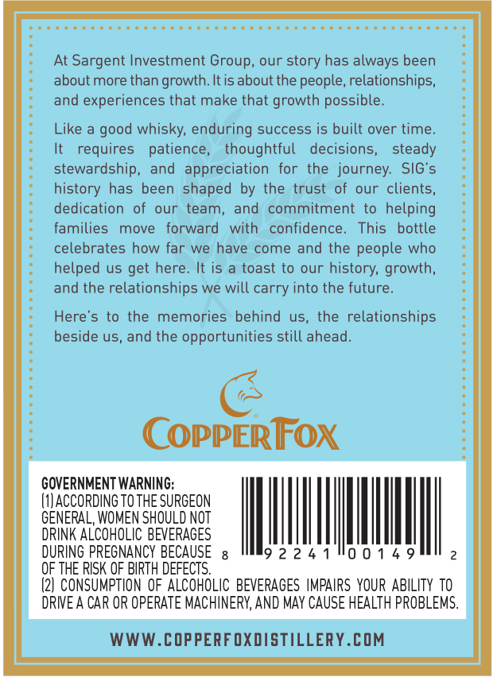
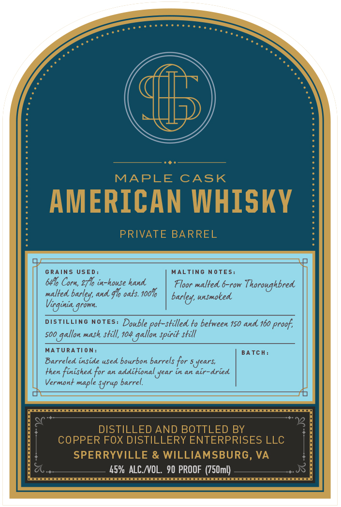

# TTB COLA Label Images - TTBID 26215001000596

**Brand Name:** COPPER FOX DISTILLERY ENTERPRISES

**Issue Date:** 08/17/2026

**Origin Code:** 05

**Product Class/Type:** 140

**Source:** [TTB Public COLA Registry](https://ttbonline.gov/colasonline/viewColaDetails.do?action=publicFormDisplay&ttbid=26215001000596)

## Label Images

### Back Label

### Front Label

### Label 3

## Extracted Label Text

*Text extracted via OCR - may contain errors*

**Detected Proof:** 160
**Detected Age:** 5 Years

### Back Label

At Sargent Investment Group, our story has always been
about more than growth. It is about the people, relationships,
and experiences that make that growth possible.

Like a good whisky, enduring success is built over time.
It requires patience, thoughtful decisions, steady
stewardship, and appreciation for the journey. SIG’s
history has been shaped by the trust of our clients,
dedication of our team, and commitment to helping
families move forward with confidence. This bottle
celebrates how far we have come and the people who
helped us get here. It is a toast to our history, growth,
and the relationships we will carry into the future.

Here’s to the memories behind us, the relationships
beside us, and the opportunities still ahead.

(>

CopPERFOX

GOVERNMENT WARNING:
1] ACCORDING TO THE SURGEON
GENERAL, WOMEN SHOULD NOT
DRINK ALCOHOLIC BEVERAGES
2

DURING PREGNANCY BECAUSE 92241"00149

OF THE RISK OF BIRTH DEFECTS.

(2] CONSUMPTION OF ALCOHOLIC BEVERAGES IMPAIRS YOUR ABILITY TO
DRIVE A CAR OR OPERATE MACHINERY, AND MAY CAUSE HEALTH PROBLEMS.

WWW.COPPERFOXDISTILLERY.COM

### Front Label

MAPLE
CASK
AMERICAN WHISKY
PRIVATE BARREL
GRAINS USED :
MALTING NOTES:
6416 Corn, 2F6 in-house hand
Floor malted 6-row
Thoroughbred
malted
ad
9lo oats: 1001
barley; usmoked
Vitginia gronn
DISTILLING NOTES: Double pot-stilled to betreen 150 and 160 proof;
5oo
mash still, 104
still
MATURATION:
BA Tch :
Barreled inside
bourbon barrels for 5years;
Hhen finished for an additionalyear in an air-dried
Vermont
{Yrup barrel
DISTILLED AND BOTTLED BY
COPPER FOX DISTILLERY ENTERPRISES LLC
SPERRYVILLE & WILLIAMSBURG, VA
45% ALC NOL   90 PROOF  (750ml)
barley;
gallon
gallon _
Spiri_
ufed
maple

### Label 3

i)

ARC

E

NT isvestMent croup

gnous 1Nawis3an!| LDNADUVS
