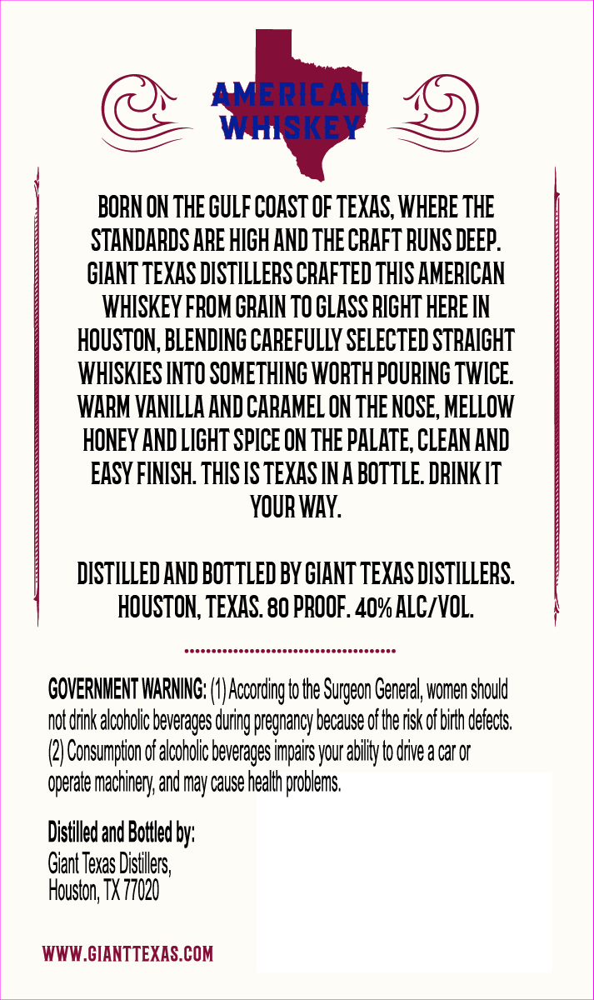
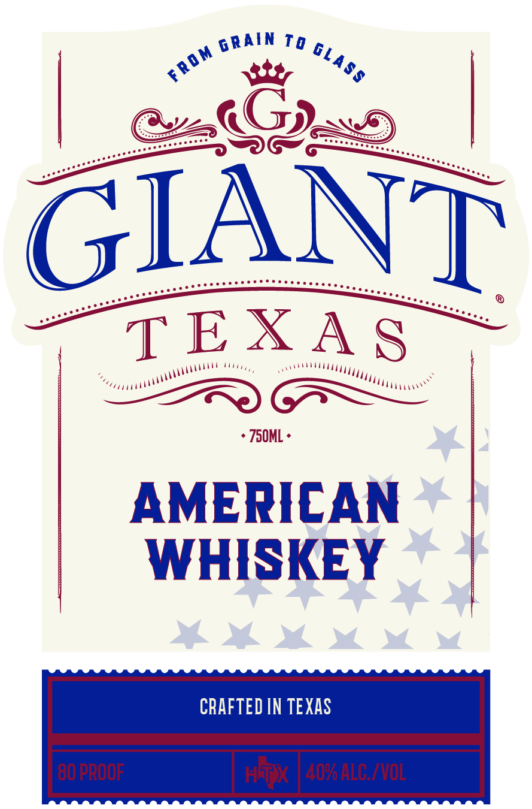

# TTB COLA Label Images - TTBID 26215001000648

**Brand Name:** GIANT TEXAS

**Issue Date:** 08/11/2026

**Origin Code:** 44

**Product Class/Type:** 140

**Source:** [TTB Public COLA Registry](https://ttbonline.gov/colasonline/viewColaDetails.do?action=publicFormDisplay&ttbid=26215001000648)

## Label Images

### Back Label

### Front Label

## Extracted Label Text

*Text extracted via OCR - may contain errors*

**Detected Proof:** 80

### Back Label

AMERICAM
WHSKEY
BORN ON THE GuLF coAST OF TeXAS, WHERE THE
STANDARDS APE HIGH AND THE CrAFT RUNS DEEP
GIANT TEXAS DISTILLERS CRAFTED THIS AMERICAN
whISKeY FBOM GRAIN TO GLASS BIGHT HEbE IN
HOUSTON, BLENDING CaREFuLLy SELECTED STbAIGHT
WHISKIES INTO SOMETHING WORTH POURING TWICE.
WARM VANILLA AND CARAMEL ON THE NOSE, MELLOW
HONEY AND LIGHT SPICE ON THE PALATE, CLEAN AND
EASY FINISH. THIS IS TEXAS INA BOTTLE. DbINK IT
YOUR WAY:
DISTILLED AND BOTTLED BY GHANT TEXAS DISTILLERS.
HOUSTON;, TEXAS. 80 PROOF. 4o% ALCIVOL.
COVERNMENT WARNING;
According to Hhe Surgeon Ceneral, women should
not drnk alcoholic beverages during pregnancy because of the rsk of birh derects;
Consumption of alcoholc beverages impairs your abilly to drve a car Or
qperate machinery and may cause |
Distilled and Boilled by;
Giant Texas Distillers;,
Houston; TX 77020
WWW.CIANTTEXAS COM

### Front Label

Td
6
GIANT
TEXA $
Z50ML
AMERICAN
WHISKEY
CRAFTED IN TEXAS
80 PROOF
HTX
4096 ALG ivoL
G RAIN
GLASS
FROM
