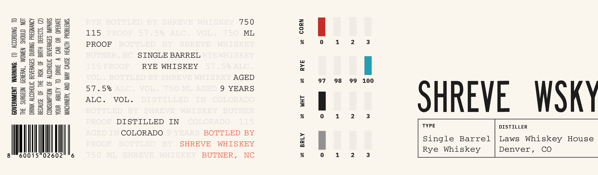

# TTB COLA Label Images - TTBID 26215001000704

**Brand Name:** SHREVE WHISKEY

**Issue Date:** 08/17/2026

**Origin Code:** 35

**Product Class/Type:** 140

**Source:** [TTB Public COLA Registry](https://ttbonline.gov/colasonline/viewColaDetails.do?action=publicFormDisplay&ttbid=26215001000704)

## Label Images

### Label 1

## Extracted Label Text

*Text extracted via OCR - may contain errors*

**Detected Proof:** 115
**Detected Age:** 9 Years

### Label 1

SHREVE WSKY

3

98 99 100

97

Mic

NYOD = JAd 8 LHM 38

750

ML

AGED

9 YEARS

SINGLE BARREL
RYE WHISKEY

115

PROOF
57.5%
ALC. VOL.

‘SWAT8OUd HIIVIH JSM¥D AV ONY ‘ABSNIHOW
AWU3d0 YO WWD VY JNUC OL ALMIBY YNOA
SUIVANI SOVUIAIE SNCHOTIY 40 NOLAWNSNOI
(2) ‘SL03430 HIUIG 40 YSId 3HL 40 3snvo3a
AONWNSSUd SNUG SIOVYIAIG ONOHOTTY NYC
LON GINOHS NJWOM ‘TWH3N39 NOZOUNS IHL
OL SNIGHOIIY (1) ‘SNINYWM LNSINYSAO9

Mic

DISTILLED IN
COLORADO

TYPE

(ee)

DISTILLER
Single Barrel | Laws Whiskey House
Denver,

Rye Whiskey

Alda 38

Cc

BOTTLED BY
WHISKEY

SHREVE
BUTNER,

60015°02602 "6

8 |
