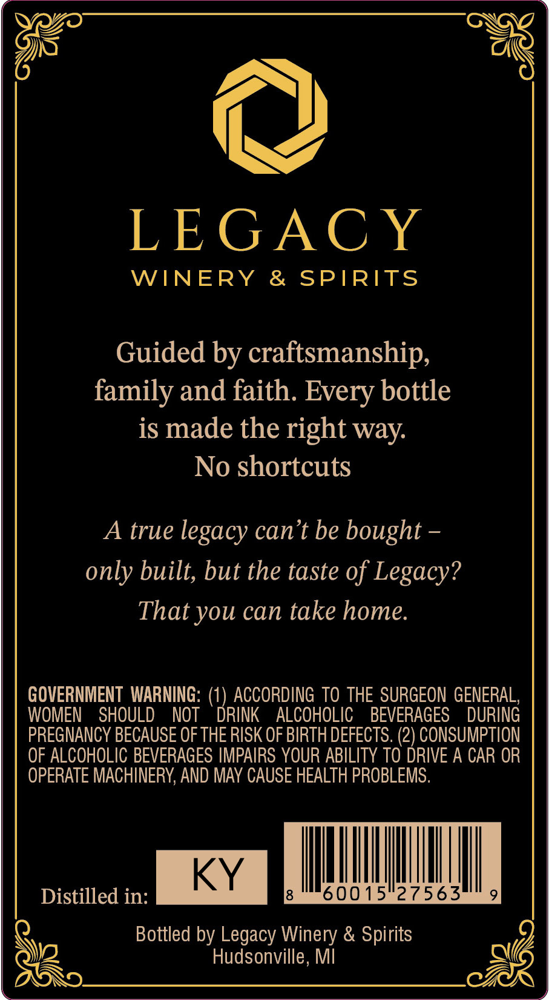
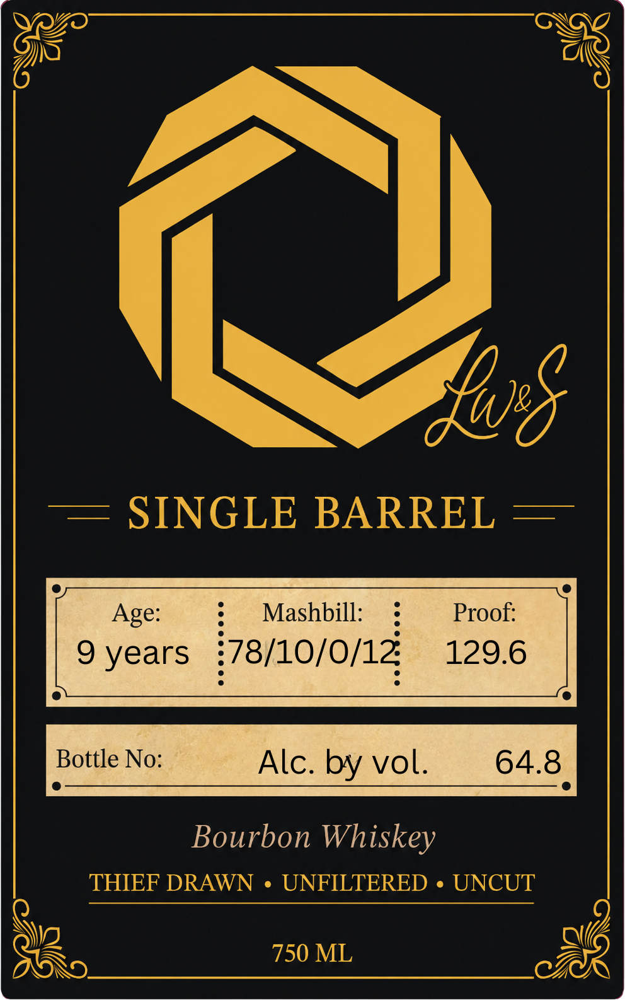

# TTB COLA Label Images - TTBID 26215001000718

**Brand Name:** LW&S

**Issue Date:** 08/11/2026

**Origin Code:** 06

**Product Class/Type:** 101

**Source:** [TTB Public COLA Registry](https://ttbonline.gov/colasonline/viewColaDetails.do?action=publicFormDisplay&ttbid=26215001000718)

## Label Images

### Back Label

### Label 1

## Extracted Label Text

*Text extracted via OCR - may contain errors*

**Detected Age:** 9 Years

### Back Label

LEGAC Y
WINERY
& SPIRITS
Guided by craftsmanship;
family and faith: Every bottle
is made the right way:
No shortcuts
A true
legacy can't be bought
only built, but the taste of Legacy?
That you can take home.
GOVERNMENT  WARNING:
ACCORDING TO THE SURGEON GENERAL,
WOMEN
SHOULD
NOT
DRINK
ALCOHOLIC
BEVERAGES
DURING
PREGNANCY BECAUSE OF THE RISK OF BIRTH DEFECTS. (2) CONSUMPTION
OF ALCOHOLIC BEVERAGES IMPAIRS YOUR ABILITY TO DRIVE A CAR OR
OPERATE MACHINERY, AND MAY CAUSE HEALTH PROBLEMS:
KY
Distilled in:
60015"27563
Bottled by Legacy Winery & Spirits
Hudsonville , MI

### Label 1

SINGLE BARREL
Mashbill:
Proof:
9 years
78/10/0/14
129.6
Bottle No:
Alc: by vol:
64.8
Bourbon Whiskey
THIEF DRAWN
UNFILTERED
UNCUT
750 ML
108
Age:
