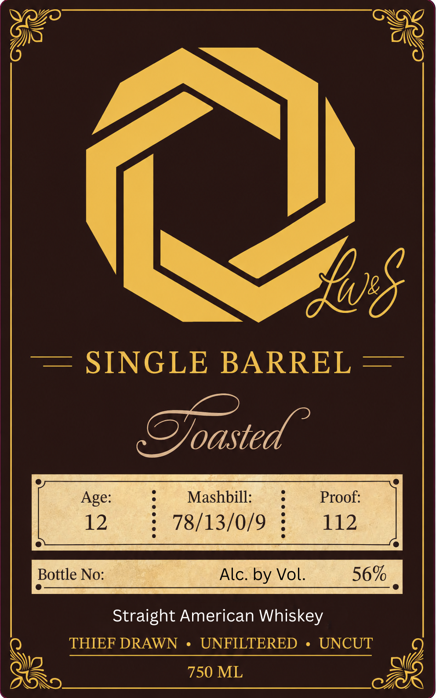

# TTB COLA Label Images - TTBID 26215001000723

**Brand Name:** LW&S

**Issue Date:** 08/11/2026

**Origin Code:** 06

**Product Class/Type:** 140

**Source:** [TTB Public COLA Registry](https://ttbonline.gov/colasonline/viewColaDetails.do?action=publicFormDisplay&ttbid=26215001000723)

## Label Images

### Back Label

### Label 1

## Extracted Label Text

*Text extracted via OCR - may contain errors*

**Detected Proof:** 112

### Back Label

LEGACY
WINERY
& SPIRITS
Guided by craftsmanship;
family and faith: Every bottle
is made the right way:
No shortcuts
A true
legacy can't be bought
only built; but the taste of Legacy?
That you can take home:
GOVERNMENT  WARNING:
ACCORDING TO THE SURGEON GENERAL,
WOMEN
SHOULD
NOT
DRINK
ALCOHOLIC
BEVERAGES
DURING
PREGNANCY BECAUSE OF THE RISK OF BIRTH DEFECTS. (2) CONSUMPTION
OF ALCOHOLIC BEVERAGES IMPAIRS YOUR ABILITY TO DRIVE A CAR OR
OPERATE MACHINERY, AND MAY CAUSE HEALTH PROBLEMS.
60015"27563
Bottled by Legacy Winery & Spirits
Hudsonville , MI

### Label 1

we oe)

Oey
yAS)
6

WI

= SINGLE BARREL —

ipa

Mashbill:
78/13/0/9
Bottle No: Alc. by Vol. 56%
——————— sss
Straight American Whiskey
Q THIEF DRAWN ¢ UNFIL UTE ERED UN YCUT 19)
Q 750 ML pA
