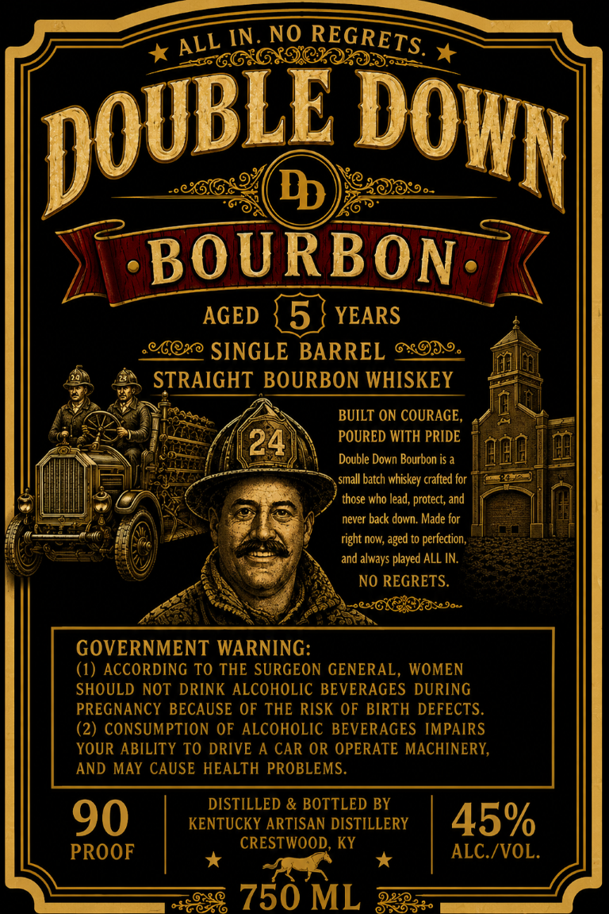
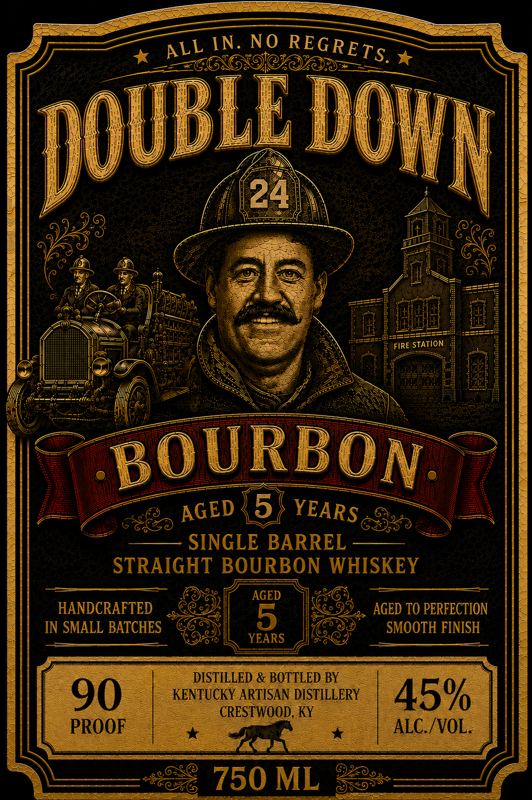

# TTB COLA Label Images - TTBID 26216001000047

**Brand Name:** DOUBLE DOWN

**Issue Date:** 09/02/2026

**Origin Code:** 22

**Product Class/Type:** 101

**Source:** [TTB Public COLA Registry](https://ttbonline.gov/colasonline/viewColaDetails.do?action=publicFormDisplay&ttbid=26216001000047)

## Label Images

### Back Label

### Front Label

## Extracted Label Text

*Text extracted via OCR - may contain errors*

**Detected Proof:** 90
**Detected Age:** 5 Years

### Back Label

IN
NO
BOURBON
AGED
5
YEARS
90
SINGLE BARREL
STRAIGHT BOURBON WHISKEY
BUILT ON COURAGE,
24
POURED WITH PRIDE
Double Down Bourbon is a
small batch whiskey crafted for
those who lead , protect; and
never back down Made for
right now; aged to perfection,
and always played ALL IN.
NO REGRETS.
Bo
GOVERNMENT WARNING:
(1) ACCORDING TO THE SURGEON GENERAL, WOMEN
SHOULD NOT DRINK ALCOHOLIC BEVERAGES DURING
PREGNANCY BECAUSE OF THE RISK OF BIRTH DEFECTS.
(2) CONSUMPTION OF ALCOHOLIC BEVERAGES IMPAIRS
YOUR ABILITY TO DRIVE
A CAR OR OPERATE MACHINERY,
AND MAY CAUSE HEALTH PROBLEMS
DISTILLED & BOTTLED BY
90
KENTUCKY ARTISAN DISTILLERY
45%
CRESTWOOD
KY
PROOF
ALC /VOL.
0805
750 ML
92833
REGRETS.
ALL
DOUBLE
DOWN!

### Front Label

IN. NO
EC6x6xgte%e
C0r
24
Fire Station
BOURBON
5
SINGLE BARREL
STRAIGHT BOURBON WHISKEY
AGED
HANDCRAFTED
AGED TO PERFECTION
IN SMALL BATCHES
5
SMOOTH FINISH
YEARS
DISTILLED & BOTTLED BY
90
KENTUCKY ARTISAN DISTILLERY
45%
CRESTWOOD, KY
PROOF
ALC_/VOL.
750 ML
REGRETS.
ALL
IDouBLe
DOWN L
YEARS
AGED
