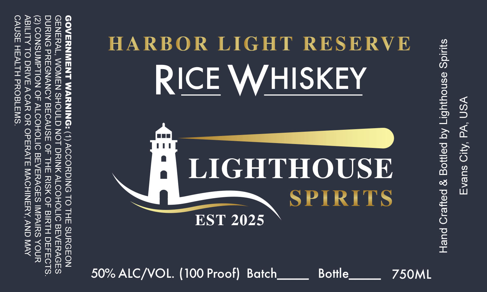

# TTB COLA Label Images - TTBID 26216001000126

**Brand Name:** LIGHTHOUSE SPIRITS

**Fanciful Name:** HARBOR LIGHT RESERVE

**Issue Date:** 08/10/2026

**Origin Code:** 39

**Product Class/Type:** 140

**Source:** [TTB Public COLA Registry](https://ttbonline.gov/colasonline/viewColaDetails.do?action=publicFormDisplay&ttbid=26216001000126)

## Label Images

### Label 1

## Extracted Label Text

*Text extracted via OCR - may contain errors*

**Detected Proof:** 100

### Label 1

YSN ‘Wd ‘AyD suerg
syuids esnoyjybr7 Aq payjog 9 payed pueH

750ML

SPIRITS
Bottle

EST 2025

HARBOR LIGHT RESERVE
RICE WHISKEY
LIGHTHOUSE

50% ALC/VOL. (100 Proof) Batch

GOVERNMENT WARNING: (1) ACCORDING TO THE SURGEON
GENERAL, WOMEN SHOULD NOT DRINK ALCOHOLIC BEVERAGES
DURING PREGNANCY BECAUSE OF THE RISK OF BIRTH DEFECTS.
(2) CONSUMPTION OF ALCOHOLIC BEVERAGES IMPAIRS YOUR
ABILITY TO DRIVE ACAR OR OPERATE MACHINERY, AND MAY
CAUSE HEALTH PROBLEMS.
