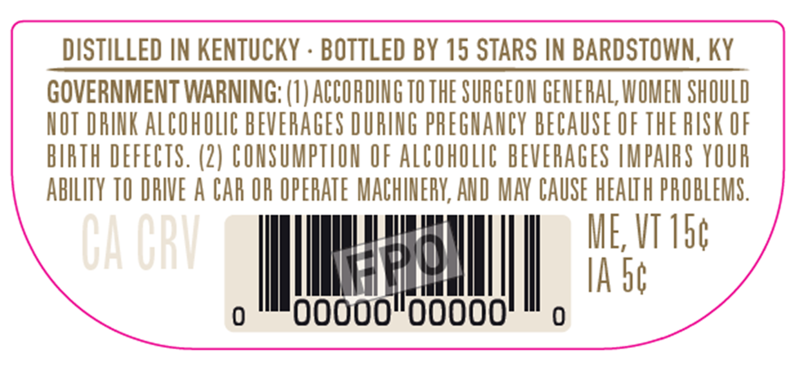
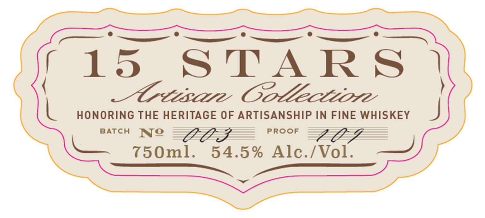
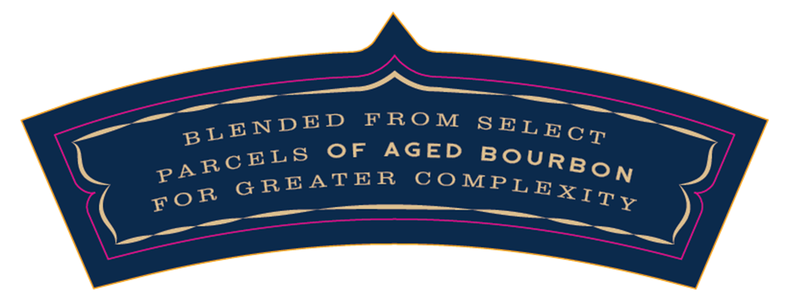
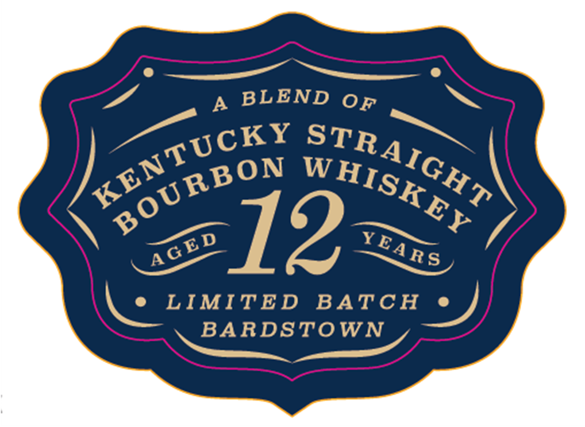

# TTB COLA Label Images - TTBID 26216001000134

**Brand Name:** 15 STARS

**Issue Date:** 08/10/2026

**Origin Code:** 22

**Product Class/Type:** 101

**Source:** [TTB Public COLA Registry](https://ttbonline.gov/colasonline/viewColaDetails.do?action=publicFormDisplay&ttbid=26216001000134)

## Label Images

### Back Label

### Label 1

### Label 2

### Label 3

## Extracted Label Text

*Text extracted via OCR - may contain errors*

**Detected Proof:** 109

### Back Label

DISTILLED IN KENTUCKY
BOTTLED BY 15 STARS IN BARDSTOWN, KY
GOVERNMENT WARNING: (I) ACCORDING TO THE SURGEON GENERAL; WOMEN SHOULD
NOT DRINK AlCohOLC BEVERAGES URING PREGHANCY BECAUSE OF THE RISK OF
BIRTH DEFECTS. (2) CONSUMPTLON €F Alcoholc BEVERAGES UMPAIRS YOUR
AblLITY TO DRIVE A CAR OR OPERATE MACHINERY, AND MAY CAUSE HEALTH PROBLEMS .
Ga ORU
H
ME; VT 156
IA S6
ooooo"oooo

### Label 1

LO ———— ee

flo STAR

S |

_ Crease Oottectvore

L HONORING THE HERITAGE OF ARTISANSHIP IN FINE WHISKEY

BATCH Ne

PROOF

750ml.

54.5% Alc./Vol.

### Label 2

FRO M
F
AGED
G REATE R
BLENDE D
SELE C T
BoURBON
PA RCELS
C0 MPLEXITY
FOR

### Label 3

A
BLEND
12
LIMITED
BATCH
BARDSTOWN
0F
KENTUCKY
STRAIGHT
BOURBON
W HISKEY
YEARS
AGED
