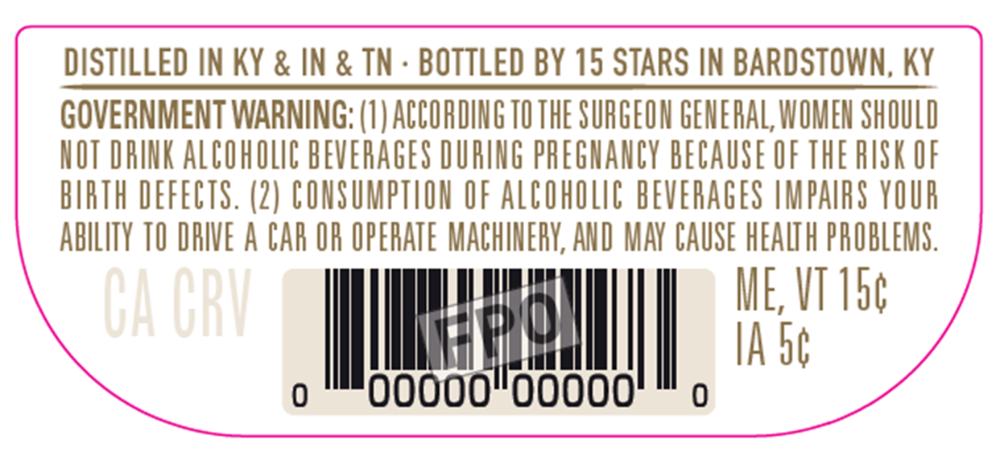
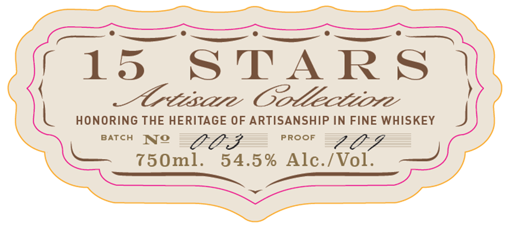
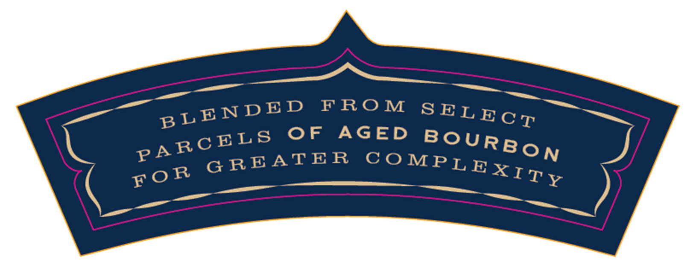
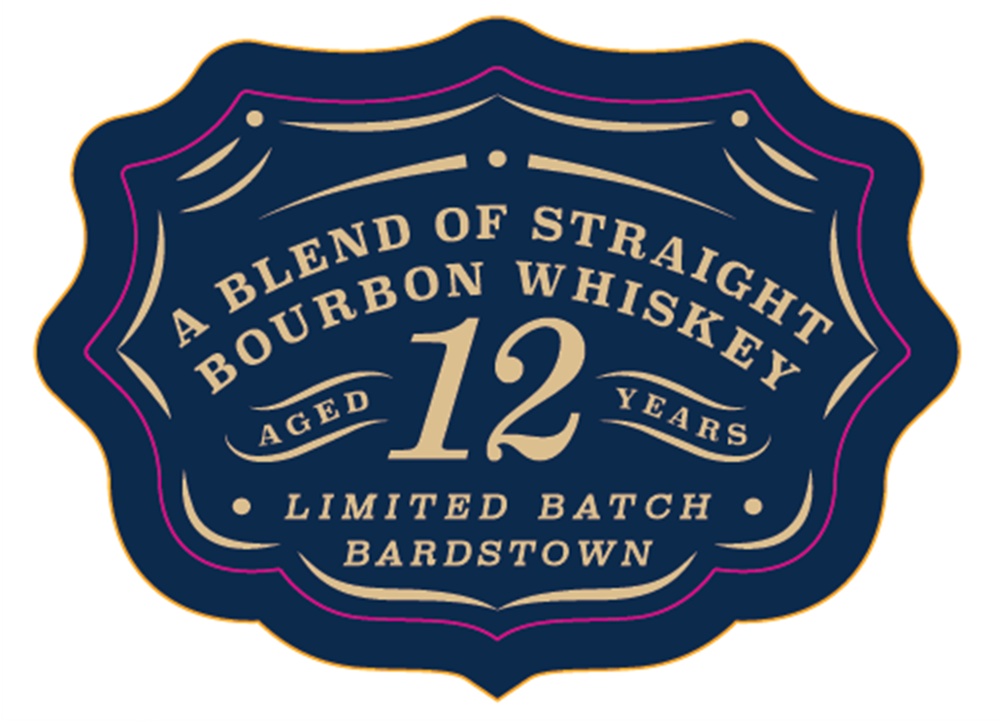

# TTB COLA Label Images - TTBID 26216001000138

**Brand Name:** 15 STARS

**Issue Date:** 08/10/2026

**Origin Code:** 22

**Product Class/Type:** 121

**Source:** [TTB Public COLA Registry](https://ttbonline.gov/colasonline/viewColaDetails.do?action=publicFormDisplay&ttbid=26216001000138)

## Label Images

### Back Label

### Label 1

### Label 2

### Label 4

## Extracted Label Text

*Text extracted via OCR - may contain errors*

### Back Label

DISTILLED IN KY & IN & TN - BOTTLED BY 15 STARS IN BARDSTOWN, KY

GOVERNMENT WARNING: (1) ACCORDING 10 THE SURGEON GENERAL WOMEN SHOULD

NOT DRINK ALCOHOLIC BEVERAGES DURING PREGNANCY BECAUSE OF THE RISK OF

BIRTH DEFECTS. (2) CONSUMPTION OF ALCOHOLIC BEVERAGES IMPAIRS YOUR

ABILITY 10 DRIVE A CAR OR OPERATE MACHINERY, AND MAY CAUSE Icy PROBLEMS

ME, VI 15¢

|

i be

a

ul

### Label 1

a meme 8 8 ee 8 ee 8
f1ls STARS |
Creme Oottecttore
L HONORING THE HERITAGE OF ARTISANSHIP IN FINE WHISKEY J

BATCH WO PROOF ZA
50m! $4.5% Ale./Vol._ —
GIS Oe

### Label 2

FRO M
OF
AGED
G REATE R
BL ENDE D
SELE C T
BoURBON
PA RCELS
C0 MPL EXITY
FO R

### Label 4

OF
p
12
LIMITED
BATCH
BARDSTOWN
STRAIGHT
BLEND
BoURBON
WHISKEY
YEARS
AGED
