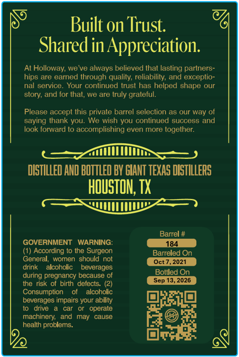
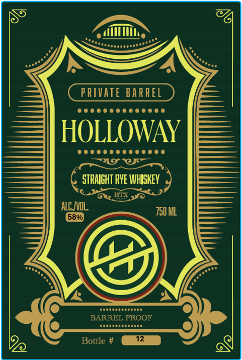

# TTB COLA Label Images - TTBID 26216001000187

**Brand Name:** HOLLOWAY

**Fanciful Name:** PRIVATE BARREL

**Issue Date:** 09/01/2026

**Origin Code:** 44

**Product Class/Type:** 102

**Source:** [TTB Public COLA Registry](https://ttbonline.gov/colasonline/viewColaDetails.do?action=publicFormDisplay&ttbid=26216001000187)

## Label Images

### Back Label

### Front Label

## Extracted Label Text

*Text extracted via OCR - may contain errors*

**Detected Proof:** 116

### Back Label

Built on Trust
Shared in Appreciation:
At Holloway; we ve always believed that lasting partners-
are earned through qualily; reliability; and exceptio-
nal service
Your continued trust has helped shape our
and for thal;, we are truly grateful:
Please accept this private barrel selection as our way of
saying Ihank you: We wish you continued success and
look forward to accomplishing even more together:
DIsTILLED AND BOTTLED BV GIANT TEXAS DISTILLERS
HOUSTN; TX
Barrel #
GOVERNMENT
WARNING:
184
(1) According to the Surgeon
Barreled On
General;
women  should
not
Oct 7,2021
drink
alcoholic
beverages
during pregnancy because
Botlled On
the risk of birth
deiects:
Sep 13,2026
Consumption
alcoholic
beverages impairs your ability
drive
car
operate
machinery;
and
may
cause
health
problems
hips
story;

### Front Label

PRIVATE BARREL
HOLLOWAY
STRAIGHT RvE WHIshey
Gkr HTX jo
ALC IVOL
750 ML
58%
#oddaetnoi
BARREL PROOF
#odraradrddae
Bottle #
