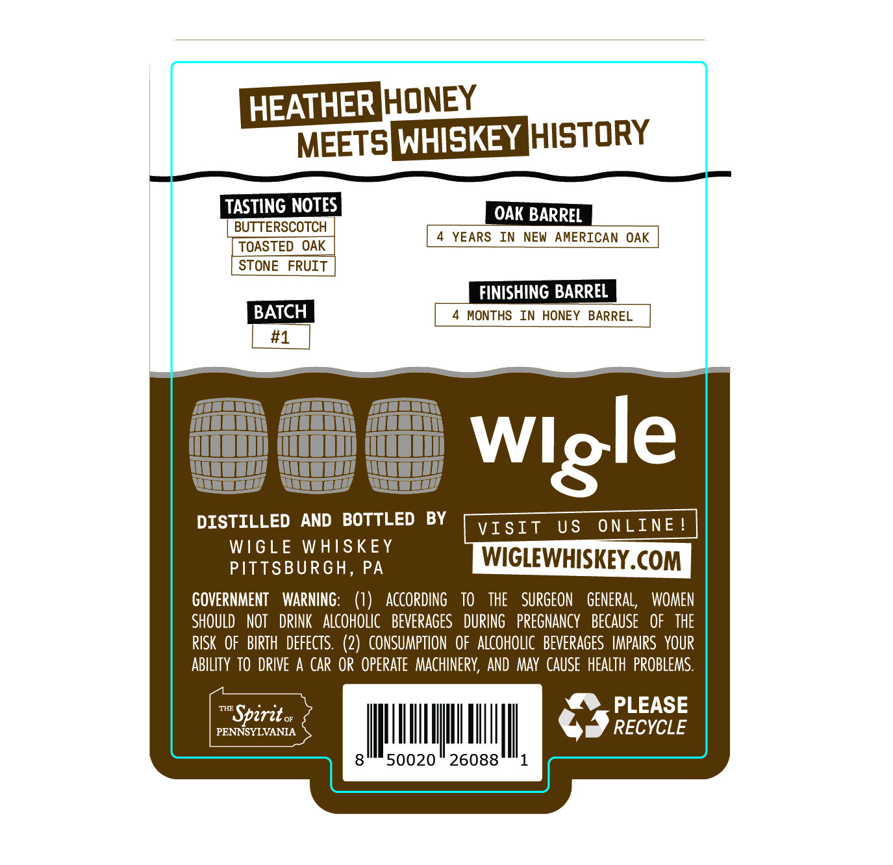
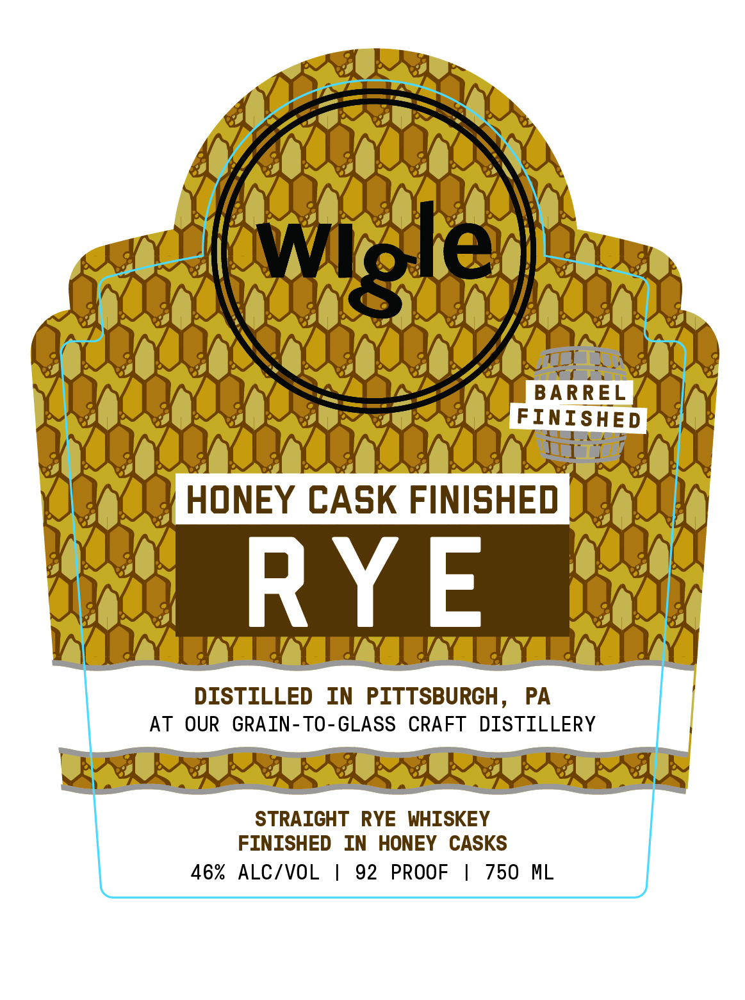

# TTB COLA Label Images - TTBID 26216001000264

**Brand Name:** WIGLE

**Issue Date:** 08/11/2026

**Origin Code:** 39

**Product Class/Type:** 102

**Source:** [TTB Public COLA Registry](https://ttbonline.gov/colasonline/viewColaDetails.do?action=publicFormDisplay&ttbid=26216001000264)

## Label Images

### Back Label

### Front Label

## Extracted Label Text

*Text extracted via OCR - may contain errors*

**Detected Proof:** 92

### Back Label

HEATHERJHONEY
MEETSWHISKEY HISTORY
TASTING NOTES
OAK BARREL
BUTTERSCOTCH
YEARS
In
NEW AMERICAN OAK
TOASTED
OAK
STONE
FRUIT
FINISHING BARREL
BATCH
MONTHS
In HONEY
BARREL
#1
DISTILLED
AND  BOTTLED
BY
VIsIt
U S
ONLINE
WIGLE
WHISKEY
PITTSBURGH, PA
WIGLEWHISKEY.COM
GOVERNMENT
WARNING:
(1)
ACcORDing
TO
THE
SURGEON   GENERAL,
WOMEN
SHOULD
NOT   DRINK   aLcoHOLIC   BEVERAGES
DURING   PREGNANCY
BECAUSE
OF   THE
RISK   OF   BIRTH   defects.  (2)  CONSUMPTION   OF   ALCOHOLIC   BEVERAGES  IMPAIRS  YOUR
ABILITY TO DRIVE
CAR OR  OperaTe   MAchineRV, AND  May  CAUSE  HEALTh  PROBLEMS.
THE
PLEASE
Spirito _
PENNSYLVANIA
RECYCLE
50020
26088
Wlgle

### Front Label

7 ~
LYON .
(OY OY enw y
Wie 1 1 foes WAN

oA WA E | | 0G JA
Pee ye Gece Telge gecgee
CLOUD
BAA ROO ZA SA
OO DSSSe2 BE 2288 DD
SAO OEE DO ane
EOE OOOO
erat HONEY CASK FINISHED Jey"
ony. Oyo
vgee| segel
NOV TAY TY Yay ey vy)
AT OUR GRAIN-TO-GLASS CRAFT DISTILLERY |
BEINGS GRIER S
FINISHED IN HONEY CASKS
46% ALC/VOL | 92 PROOF | 750 ML
