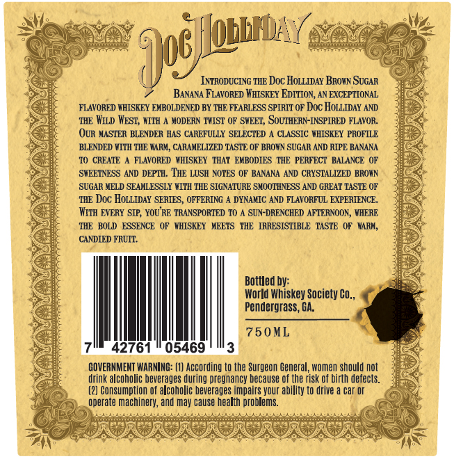
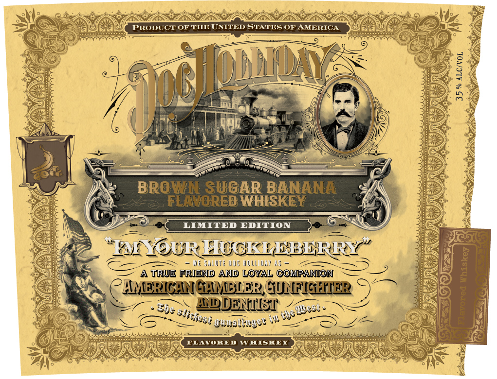

# TTB COLA Label Images - TTBID 26216001000305

**Brand Name:** DOC HOLLIDAY

**Fanciful Name:** BROWN SUGAR BANANA FLAVORED WHISKEY

**Issue Date:** 08/12/2026

**Origin Code:** 08

**Product Class/Type:** 149

**Source:** [TTB Public COLA Registry](https://ttbonline.gov/colasonline/viewColaDetails.do?action=publicFormDisplay&ttbid=26216001000305)

## Label Images

### Back Label

### Front Label

## Extracted Label Text

*Text extracted via OCR - may contain errors*

### Back Label

'Jue [uaurw (
INTRODUCING THE Doc HoLLIDAY BROwN SUGAR
BANANA FLAVORED WHTSKEY EDITION, AN EXCEPTIONAL
FIAAVORED WHISKEY EMBOLDENED BY THE FEARLFSS SPIRIT OF Doc HOLLIDAY AND
THE Wiid WEST, WITH
MODERN TWIST OF SWEET, SoUTHERN-INSPIRED FLAVOR:
OUR MASTER BLENDER HAS CAREFULLY SELECTED
CLASSIC VHISKEY PROFILE
BLENDED WITH 'THE WARM, CARAMELIZED TASTE OF BRORN SUGAR AND RIPE BANANA
I0 CREATE
FLAVORED   WHISKEY   THAT' EMBODIES  'TIHE PERFECT BALALNCE OF
SWEETNESS AND DEPTH.  TIE LUSH NOTES OF BANANA AND CRYSTALIZED BROWN
SUGAR MELD SEAMLESSLY WITH THE SIGNATURE SMOOTINESS AND GREAT TASTE OF
THE Doc HoLLIDAY SERIES
OFFERING
DXNAMIC AND FLAVORFUL EXPERIENCE:
WITh  EVERY SIP; YOU RE TRANSPORTED TO
SUN-DRENCHED AFTERNOON, WHERE
THE   BOLD   ESSENCE  OF
WHISKEY
MEETS
THE   IRRESISTIBLE
TASTE
WARM,
CANDIED FRUIT.
Bottled by:
World Whiskey Society Co,
Pendergrass, GA.
75 0 ML
42761
05469
GOVERNMENT WARNING: (1] According to the Surgeon General, women should not
drink alcoholic beverages during pregnancy because Of the risk of birth defects:
(2] Consumption of alcoholic beverages impairs your ability to drive
car Dr
operate machinery; and may cause health problems:

### Front Label

PRODUCT OF THE UNITED STATES OF AMERICA
mw
1
BROWN SUGAR BANANA
FLEHORED WHISKEY
LIMITED EDITION
@YGURHUGKLEBBERIYY
J: SliM: iic HUIL_IAI4;
A TRUE FRIEND AND LOYAL COMPANION
(AMERICANGAMBLER GUNFIGHIE
Sf:
IDDENNsI' +3e
7
Junsumyee +
TLAVORED
IV HISKEX
0
Niiss:
