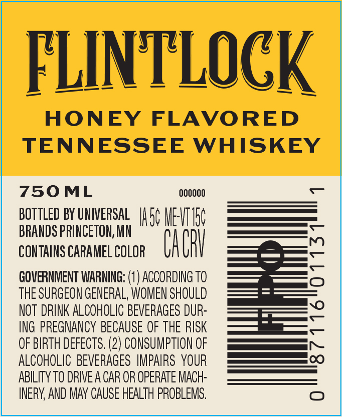
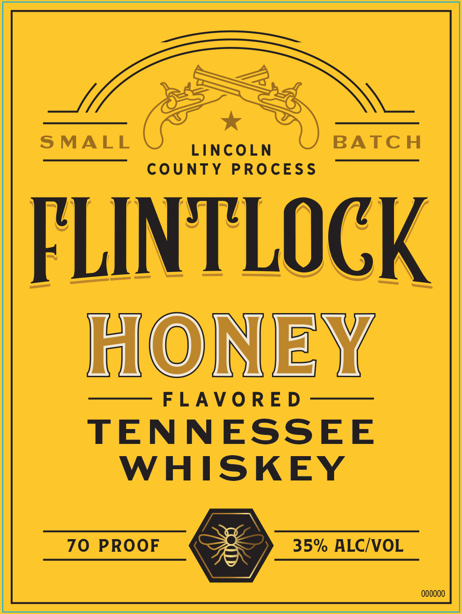

# TTB COLA Label Images - TTBID 26216001000362

**Brand Name:** FLINTLOCK

**Fanciful Name:** HONEY

**Issue Date:** 08/12/2026

**Origin Code:** 27

**Product Class/Type:** 149

**Source:** [TTB Public COLA Registry](https://ttbonline.gov/colasonline/viewColaDetails.do?action=publicFormDisplay&ttbid=26216001000362)

## Label Images

### Back Label

### Label 1

## Extracted Label Text

*Text extracted via OCR - may contain errors*

**Detected Proof:** 140

### Back Label

FLINTLOCK
HONEY
FLAVORED
TENNESSEE
WHISKEY
750ML
00OOOO
BOTTLED BY UNIVERSAL
Isc WEVIC
BRANDS PRINCETON, MN
CONTAINS CARAMEL COLOR
CaghV
2
GOVERNMENT WARNING: (1 ) ACCORDING TO
THE SURGEON GENERAL, WOMEN SHOULD
NOT DRINK ALCOHOLIC BEVERAGES DUR-
ING PREGNANCY BECAUSE OF THE RISK
OF BIRTH DEFECTS. (2) CONSUMPTION OF
0
ALCOHOLIC  BEVERAGES IMPAIRS YOUR
ABILITY TO DRIVE A CAR OR OpERATE MACH:
INERY AND MAY CAUSE HEALTH PROBLEMS,
0
8

### Label 1

SMALL
BATC H
LINCOLN
County
PROcESS
FLINTLOCK
HONEY
FLAVO RE D
TENNESSEE
WHISKEY
70
PROOF
35% ALCIVOL
000000
